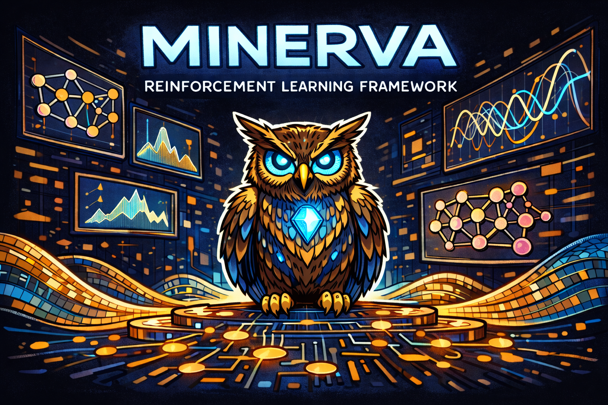
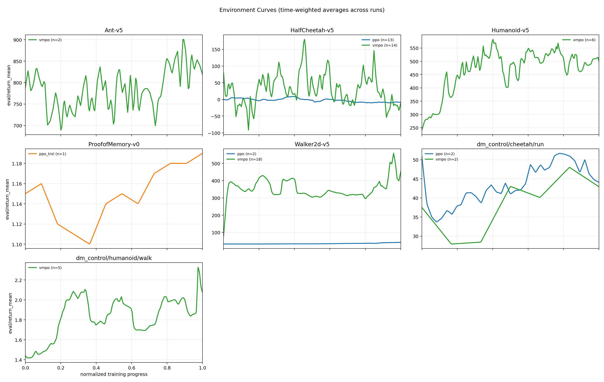

# Minerva - Reinforcement Learning Algorithms in PyTorch

[](https://github.com/nenuadrian/rl/actions/workflows/python-app.yml)

[See the latest report here.](reports/latest/README.md)



- [Minerva - Reinforcement Learning Algorithms in PyTorch](#minerva---reinforcement-learning-algorithms-in-pytorch)
	- [Installation](#installation)
	- [Usage](#usage)
	- [video](#video)
	- [hyperparameters](#hyperparameters)
	- [Benchmarks](#benchmarks)
	- [Reports](#reports)

## Installation

```bash
conda create -n minerva python=3.11 -y
conda activate minerva
pip install -r requirements.txt
```

## Usage

```bash
python -m main mpo --env dm_control/cheetah/run
python -m main ppo --env HalfCheetah-v5
python -m main vmpo --env dm_control/cheetah/run
```

## video

Generate a rollout video from the latest saved checkpoint:

```bash
python -m scripts.generate_video ppo --env dm_control/cheetah/run
```

Optionally specify a checkpoint path and output file:

```bash
python -m scripts.generate_video ppo --env dm_control/cheetah/run \
	--checkpoint checkpoints/ppo/dm_control-cheetah-run/ppo_step_50000.pt \
	--video_out videos/ppo-dm_control-cheetah-run.mp4
```

## hyperparameters

Hyperparameters are defined in the `hyperparameters/*.py` files for each algorithm.

## Benchmarks



```bash
bash scripts/benchmarks/mpo.sh
```

## Reports

```bash
python -m scripts.generate_report
```

By default this also tries to render a video for the best run of each environment/algorithm pair using:
`checkpoints/<algo>/<run_name>/<algo>_best.pt` -> `videos/<run_name>.mp4`

Skip that step with:

```bash
python -m scripts.generate_report --skip-videos
```
