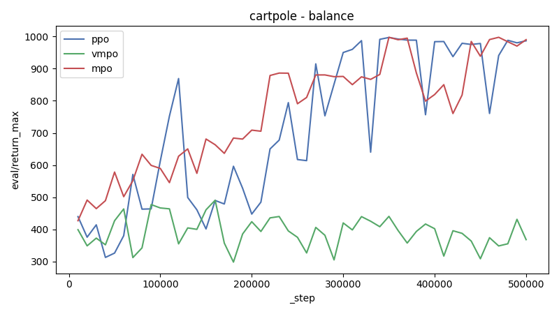
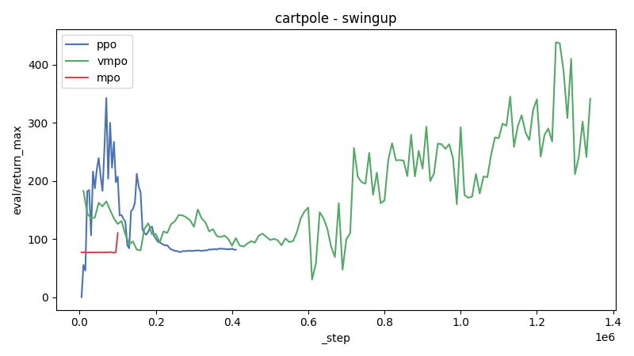
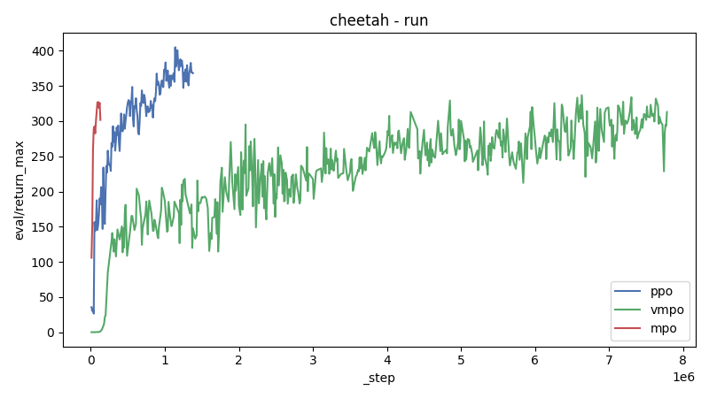
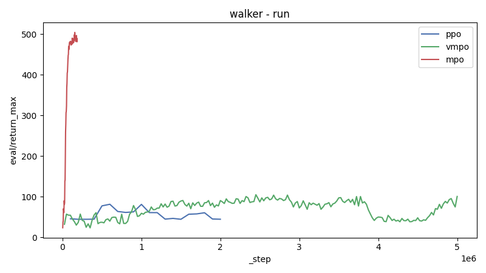
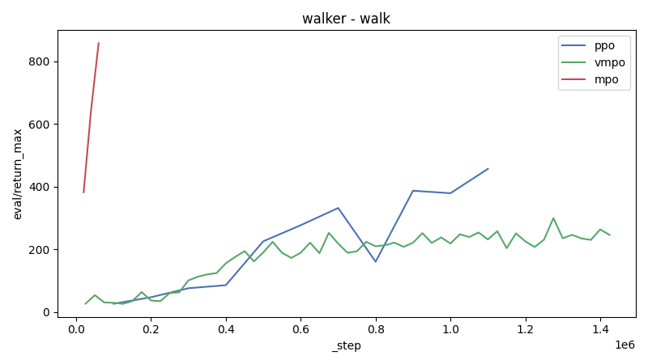

# Report

| Domain | Task | ppo | vmpo | mpo |
|---|---|---|---|---|
| cartpole | balance | [986](https://wandb.ai/adrian-research/dm_control-ppo/runs/a4cb2u94) | [368](https://wandb.ai/adrian-research/dm_control-vmpo/runs/cxjv49hs) | [990](https://wandb.ai/adrian-research/dm_control-mpo/runs/hi07qt8j) |
| cartpole | swingup | [82](https://wandb.ai/adrian-research/dm_control-ppo/runs/x996qip3) | [341](https://wandb.ai/adrian-research/dm_control-vmpo/runs/7da3cyrk) | [110](https://wandb.ai/adrian-research/dm_control-mpo/runs/0rd02xos) |
| cheetah | run | [368](https://wandb.ai/adrian-research/dm_control-ppo/runs/7csw9xnv) | [282](https://wandb.ai/adrian-research/dm_control-vmpo/runs/u7121rwm) | [301](https://wandb.ai/adrian-research/dm_control-mpo/runs/7lywk9l2) |
| walker | run | [44](https://wandb.ai/adrian-research/dm_control-ppo/runs/n2llx58b) | [100](https://wandb.ai/adrian-research/dm_control-vmpo/runs/4ity54z4) | [488](https://wandb.ai/adrian-research/dm_control-mpo/runs/n77n76jm) |
| walker | walk | [456](https://wandb.ai/adrian-research/dm_control-ppo/runs/sjhi12s8) | [245](https://wandb.ai/adrian-research/dm_control-vmpo/runs/sy35a3f8) | [857](https://wandb.ai/adrian-research/dm_control-mpo/runs/tovs64he) |

## cartpole - balance

| Run | Algorithm | _step | eval/return_max |
|---|---|---:|---:|
| [mpo-cartpole-balance](https://wandb.ai/adrian-research/dm_control-mpo/runs/hi07qt8j) | mpo | 500000 | 990 |
| [mpo-cartpole-balance](https://wandb.ai/adrian-research/dm_control-mpo/runs/avqd8inr) | mpo | 111461 | 436 |
| [ppo-cartpole-balance](https://wandb.ai/adrian-research/dm_control-ppo/runs/a4cb2u94) | ppo | 500000 | 986 |
| [vmpo-cartpole-balance](https://wandb.ai/adrian-research/dm_control-vmpo/runs/cxjv49hs) | vmpo | 500000 | 368 |
| [vmpo-cartpole-balance](https://wandb.ai/adrian-research/dm_control-vmpo/runs/7kmqr7k1) | vmpo | 500000 | 309 |
| [vmpo-cartpole-balance](https://wandb.ai/adrian-research/dm_control-vmpo/runs/3zazmifd) | vmpo | 500000 | 155 |
| [vmpo-cartpole-balance](https://wandb.ai/adrian-research/dm_control-vmpo/runs/x026g41w) | vmpo | 500000 | - |

## cartpole - swingup

| Run | Algorithm | _step | eval/return_max |
|---|---|---:|---:|
| [mpo-cartpole-swingup](https://wandb.ai/adrian-research/dm_control-mpo/runs/0rd02xos) | mpo | 100638 | 110 |
| [mpo-cartpole-swingup](https://wandb.ai/adrian-research/dm_control-mpo/runs/r3dakaqj) | mpo | 100405 | 34 |
| [mpo-cartpole-swingup](https://wandb.ai/adrian-research/dm_control-mpo/runs/n8pensxm) | mpo | 80000 | 30 |
| [mpo-cartpole-swingup](https://wandb.ai/adrian-research/dm_control-mpo/runs/zkwnoalu) | mpo | 106228 | 29 |
| [mpo-cartpole-swingup](https://wandb.ai/adrian-research/dm_control-mpo/runs/34lt5n20) | mpo | 101164 | 0 |
| [mpo-cartpole-swingup](https://wandb.ai/adrian-research/dm_control-mpo/runs/ohwedcoo) | mpo | 57000 | 0 |
| [ppo-cartpole-swingup](https://wandb.ai/adrian-research/dm_control-ppo/runs/x996qip3) | ppo | 415000 | 82 |
| [vmpo-cartpole-swingup](https://wandb.ai/adrian-research/dm_control-vmpo/runs/7da3cyrk) | vmpo | 1349632 | 341 |
| [vmpo-cartpole-swingup](https://wandb.ai/adrian-research/dm_control-vmpo/runs/zdyq372t) | vmpo | 593920 | 207 |
| [vmpo-cartpole-swingup](https://wandb.ai/adrian-research/dm_control-vmpo/runs/3sdcphf0) | vmpo | 560000 | 135 |
| [vmpo-cartpole-swingup](https://wandb.ai/adrian-research/dm_control-vmpo/runs/vgigtl2j) | vmpo | 800000 | 93 |

## cheetah - run

| Run | Algorithm | _step | eval/return_max |
|---|---|---:|---:|
| [mpo-cheetah-run](https://wandb.ai/adrian-research/dm_control-mpo/runs/7lywk9l2) | mpo | 130855 | 301 |
| [mpo-cheetah-run](https://wandb.ai/adrian-research/dm_control-mpo/runs/oezxglpr) | mpo | 155658 | 280 |
| [mpo-cheetah-run](https://wandb.ai/adrian-research/dm_control-mpo/runs/ok6xtteg) | mpo | 500000 | 70 |
| [mpo-cheetah-run](https://wandb.ai/adrian-research/dm_control-mpo/runs/hq3em7cu) | mpo | 229137 | 0 |
| [ppo-cheetah-run](https://wandb.ai/adrian-research/dm_control-ppo/runs/7csw9xnv) | ppo | 1390000 | 368 |
| [ppo-cheetah-run-GOOD](https://wandb.ai/adrian-research/dm_control-ppo/runs/fqbzbouu) | ppo | 3000000 | 346 |
| [ppo-cheetah-run](https://wandb.ai/adrian-research/dm_control-ppo/runs/l21ohjoi) | ppo | 1786000 | 187 |
| [ppo-cheetah-run](https://wandb.ai/adrian-research/dm_control-ppo/runs/kspidy3x) | ppo | 1000000 | 162 |
| [ppo-cheetah-run](https://wandb.ai/adrian-research/dm_control-ppo/runs/zqermdwk) | ppo | 3000000 | 114 |
| [ppo-cheetah-run](https://wandb.ai/adrian-research/dm_control-ppo/runs/yq5f9194) | ppo | 479232 | 106 |
| [ppo-cheetah-run](https://wandb.ai/adrian-research/dm_control-ppo/runs/tdcz6om7) | ppo | 960000 | 85 |
| [ppo-cheetah-run](https://wandb.ai/adrian-research/dm_control-ppo/runs/5y4jnojb) | ppo | 500000 | 82 |
| [ppo-cheetah-run](https://wandb.ai/adrian-research/dm_control-ppo/runs/23khve99) | ppo | 1000000 | 76 |
| [ppo-cheetah-run](https://wandb.ai/adrian-research/dm_control-ppo/runs/55r2mxt7) | ppo | 500000 | 16 |
| [ppo-cheetah-run](https://wandb.ai/adrian-research/dm_control-ppo/runs/twhjj7kr) | ppo | 500000 | 14 |
| [ppo-cheetah-run](https://wandb.ai/adrian-research/dm_control-ppo/runs/5mudgely) | ppo | 310000 | 14 |
| [vmpo-cheetah-run](https://wandb.ai/adrian-research/dm_control-vmpo/runs/u7121rwm) | vmpo | 7800000 | 282 |
| [vmpo-cheetah-run](https://wandb.ai/adrian-research/dm_control-vmpo/runs/2tgwo7b1) | vmpo | 8492000 | 238 |
| [vmpo-cheetah-run](https://wandb.ai/adrian-research/dm_control-vmpo/runs/t16tin48) | vmpo | 1802240 | 238 |
| [vmpo-cheetah-run](https://wandb.ai/adrian-research/dm_control-vmpo/runs/i6nzjm2e) | vmpo | 1980000 | 223 |
| [vmpo-cheetah-run](https://wandb.ai/adrian-research/dm_control-vmpo/runs/ntj9aaaa) | vmpo | 812000 | 215 |
| [vmpo-cheetah-run](https://wandb.ai/adrian-research/dm_control-vmpo/runs/ly3ch3dg) | vmpo | 2481000 | 200 |
| [vmpo-cheetah-run](https://wandb.ai/adrian-research/dm_control-vmpo/runs/3t0qvigc) | vmpo | 1564672 | 200 |
| [vmpo-cheetah-run-OKAY](https://wandb.ai/adrian-research/dm_control-vmpo/runs/sjpsyxt4) | vmpo | 4681728 | 196 |
| [vmpo-cheetah-run](https://wandb.ai/adrian-research/dm_control-vmpo/runs/txl8wa5g) | vmpo | 1081000 | 196 |
| [vmpo-cheetah-run](https://wandb.ai/adrian-research/dm_control-vmpo/runs/g5iqhq70) | vmpo | 2473000 | 188 |
| [vmpo-cheetah-run](https://wandb.ai/adrian-research/dm_control-vmpo/runs/0ntt11b0) | vmpo | 1605000 | 184 |
| [vmpo-cheetah-run](https://wandb.ai/adrian-research/dm_control-vmpo/runs/e2yr3kdq) | vmpo | 5278000 | 178 |
| [vmpo-cheetah-run](https://wandb.ai/adrian-research/dm_control-vmpo/runs/4i7yjzq9) | vmpo | 1721000 | 177 |
| [vmpo-cheetah-run](https://wandb.ai/adrian-research/dm_control-vmpo/runs/ch30yep2) | vmpo | 3389000 | 176 |
| [vmpo-cheetah-run](https://wandb.ai/adrian-research/dm_control-vmpo/runs/ohdisg4i) | vmpo | 666665 | 172 |
| [vmpo-cheetah-run](https://wandb.ai/adrian-research/dm_control-vmpo/runs/beho29hz) | vmpo | 1108000 | 171 |
| [vmpo-cheetah-run](https://wandb.ai/adrian-research/dm_control-vmpo/runs/z99hz1l0) | vmpo | 3500000 | 168 |
| [vmpo-cheetah-run](https://wandb.ai/adrian-research/dm_control-vmpo/runs/mcc1y69i) | vmpo | 1979976 | 161 |
| [vmpo-cheetah-run](https://wandb.ai/adrian-research/dm_control-vmpo/runs/0yuez6kj) | vmpo | 828000 | 155 |
| [vmpo-cheetah-run](https://wandb.ai/adrian-research/dm_control-vmpo/runs/gr5j8msb) | vmpo | 3522560 | 153 |
| [vmpo-cheetah-run](https://wandb.ai/adrian-research/dm_control-vmpo/runs/vcgit2nw) | vmpo | 569000 | 150 |
| [vmpo-cheetah-run](https://wandb.ai/adrian-research/dm_control-vmpo/runs/wvpmam25) | vmpo | 609000 | 145 |
| [vmpo-cheetah-run](https://wandb.ai/adrian-research/dm_control-vmpo/runs/apvf0e0h) | vmpo | 225000 | 145 |
| [vmpo-cheetah-run](https://wandb.ai/adrian-research/dm_control-vmpo/runs/v1r4pbn6) | vmpo | 10000000 | 145 |
| [vmpo-cheetah-run](https://wandb.ai/adrian-research/dm_control-vmpo/runs/0znvqczi) | vmpo | 5111000 | 143 |
| [vmpo-cheetah-run](https://wandb.ai/adrian-research/dm_control-vmpo/runs/z9tbsxwc) | vmpo | 1510000 | 141 |
| [vmpo-cheetah-run](https://wandb.ai/adrian-research/dm_control-vmpo/runs/x9aotdjr) | vmpo | 1276000 | 138 |
| [vmpo-cheetah-run](https://wandb.ai/adrian-research/dm_control-vmpo/runs/9lgbyiv9) | vmpo | 500000 | 130 |
| [vmpo-cheetah-run](https://wandb.ai/adrian-research/dm_control-vmpo/runs/z3v9fncd) | vmpo | 835000 | 127 |
| [vmpo-cheetah-run](https://wandb.ai/adrian-research/dm_control-vmpo/runs/mjcm4k2o) | vmpo | 406404 | 126 |
| [vmpo-cheetah-run](https://wandb.ai/adrian-research/dm_control-vmpo/runs/5k5gjvbm) | vmpo | 500000 | 125 |
| [vmpo-cheetah-run](https://wandb.ai/adrian-research/dm_control-vmpo/runs/z5qjy1pu) | vmpo | 387000 | 123 |
| [vmpo-cheetah-run](https://wandb.ai/adrian-research/dm_control-vmpo/runs/kp7hdx3n) | vmpo | 1699000 | 111 |
| [vmpo-cheetah-run](https://wandb.ai/adrian-research/dm_control-vmpo/runs/7rubat3x) | vmpo | 1750000 | 109 |
| [vmpo-cheetah-run](https://wandb.ai/adrian-research/dm_control-vmpo/runs/1edmhni4) | vmpo | 500000 | 102 |
| [vmpo-cheetah-run](https://wandb.ai/adrian-research/dm_control-vmpo/runs/ggbam8dl) | vmpo | 942080 | 99 |
| [vmpo-cheetah-run](https://wandb.ai/adrian-research/dm_control-vmpo/runs/eonwabcc) | vmpo | 960952 | 96 |
| [vmpo-cheetah-run](https://wandb.ai/adrian-research/dm_control-vmpo/runs/co91b2oy) | vmpo | 1420000 | 96 |
| [vmpo-cheetah-run](https://wandb.ai/adrian-research/dm_control-vmpo/runs/9x1hu01h) | vmpo | 540672 | 95 |
| [vmpo-cheetah-run](https://wandb.ai/adrian-research/dm_control-vmpo/runs/o7e4vi7q) | vmpo | 206000 | 88 |
| [vmpo-cheetah-run](https://wandb.ai/adrian-research/dm_control-vmpo/runs/h52r01bq) | vmpo | 565248 | 83 |
| [vmpo-cheetah-run](https://wandb.ai/adrian-research/dm_control-vmpo/runs/plqej52m) | vmpo | 384000 | 80 |
| [vmpo-cheetah-run](https://wandb.ai/adrian-research/dm_control-vmpo/runs/4f823uxn) | vmpo | 1153000 | 77 |
| [vmpo-cheetah-run](https://wandb.ai/adrian-research/dm_control-vmpo/runs/pxwbta1g) | vmpo | 1600000 | 77 |
| [vmpo-cheetah-run](https://wandb.ai/adrian-research/dm_control-vmpo/runs/f0p6nohk) | vmpo | 1706000 | 63 |
| [vmpo-cheetah-run](https://wandb.ai/adrian-research/dm_control-vmpo/runs/9yeqg060) | vmpo | 1250000 | 57 |
| [vmpo-cheetah-run](https://wandb.ai/adrian-research/dm_control-vmpo/runs/5s5kguuc) | vmpo | 50000 | 43 |
| [vmpo-cheetah-run](https://wandb.ai/adrian-research/dm_control-vmpo/runs/4y8tfpst) | vmpo | 604000 | 34 |
| [vmpo-cheetah-run](https://wandb.ai/adrian-research/dm_control-vmpo/runs/wuecd6us) | vmpo | 98304 | 11 |
| [vmpo-cheetah-run](https://wandb.ai/adrian-research/dm_control-vmpo/runs/mq1aysxf) | vmpo | 500000 | 10 |
| [vmpo-cheetah-run](https://wandb.ai/adrian-research/dm_control-vmpo/runs/i7outjlu) | vmpo | 436000 | 9 |
| [vmpo-cheetah-run](https://wandb.ai/adrian-research/dm_control-vmpo/runs/uq39792v) | vmpo | 992960 | 5 |
| [vmpo-cheetah-run](https://wandb.ai/adrian-research/dm_control-vmpo/runs/l8t5xz8n) | vmpo | 2150016 | 5 |
| [vmpo-cheetah-run](https://wandb.ai/adrian-research/dm_control-vmpo/runs/6r0q7rn1) | vmpo | 150000 | 4 |
| [vmpo-cheetah-run](https://wandb.ai/adrian-research/dm_control-vmpo/runs/x1z9skk3) | vmpo | 125000 | 4 |
| [vmpo-cheetah-run](https://wandb.ai/adrian-research/dm_control-vmpo/runs/sgg0ljdf) | vmpo | 1137120 | 3 |
| [vmpo-cheetah-run](https://wandb.ai/adrian-research/dm_control-vmpo/runs/hrkf46m9) | vmpo | 673000 | 2 |
| [vmpo-cheetah-run](https://wandb.ai/adrian-research/dm_control-vmpo/runs/6uyzvg39) | vmpo | 1729696 | 1 |
| [vmpo-cheetah-run](https://wandb.ai/adrian-research/dm_control-vmpo/runs/crjsyt89) | vmpo | 258256 | 0 |
| [vmpo-cheetah-run](https://wandb.ai/adrian-research/dm_control-vmpo/runs/8v0ciw65) | vmpo | 95090 | 0 |
| [vmpo-cheetah-run](https://wandb.ai/adrian-research/dm_control-vmpo/runs/ixcyxgeq) | vmpo | 220215 | 0 |

## walker - run

| Run | Algorithm | _step | eval/return_max |
|---|---|---:|---:|
| [mpo-walker-run](https://wandb.ai/adrian-research/dm_control-mpo/runs/n77n76jm) | mpo | 188111 | 488 |
| [mpo-walker-run](https://wandb.ai/adrian-research/dm_control-mpo/runs/pdu9eqhf) | mpo | 259819 | 478 |
| [ppo-walker-run](https://wandb.ai/adrian-research/dm_control-ppo/runs/n2llx58b) | ppo | 2091000 | 44 |
| [vmpo-walker-run](https://wandb.ai/adrian-research/dm_control-vmpo/runs/4ity54z4) | vmpo | 5000000 | 100 |
| [vmpo-walker-run](https://wandb.ai/adrian-research/dm_control-vmpo/runs/a3bu3bcp) | vmpo | 574000 | 86 |
| [vmpo-walker-run](https://wandb.ai/adrian-research/dm_control-vmpo/runs/mzs90pbf) | vmpo | 5000000 | 78 |
| [vmpo-walker-run](https://wandb.ai/adrian-research/dm_control-vmpo/runs/x52kb3fq) | vmpo | 1229000 | 76 |
| [vmpo-walker-run](https://wandb.ai/adrian-research/dm_control-vmpo/runs/3ipbrjno) | vmpo | 5000000 | 46 |
| [vmpo-walker-run](https://wandb.ai/adrian-research/dm_control-vmpo/runs/fjpbdysz) | vmpo | 5000000 | 34 |

## walker - walk

| Run | Algorithm | _step | eval/return_max |
|---|---|---:|---:|
| [mpo-walker-walk](https://wandb.ai/adrian-research/dm_control-mpo/runs/tovs64he) | mpo | 62152 | 857 |
| [mpo-walker-walk](https://wandb.ai/adrian-research/dm_control-mpo/runs/ej3rbqch) | mpo | 131301 | 739 |
| [mpo-walker-walk](https://wandb.ai/adrian-research/dm_control-mpo/runs/2yaebq3y) | mpo | 124645 | 657 |
| [mpo-walker-walk](https://wandb.ai/adrian-research/dm_control-mpo/runs/6urxdc2g) | mpo | 245772 | 25 |
| [ppo-walker-walk](https://wandb.ai/adrian-research/dm_control-ppo/runs/sjhi12s8) | ppo | 1113000 | 456 |
| [ppo-walker-walk](https://wandb.ai/adrian-research/dm_control-ppo/runs/h35874u8) | ppo | 1265000 | 439 |
| [ppo-walker-walk](https://wandb.ai/adrian-research/dm_control-ppo/runs/sxmgm14z) | ppo | 220000 | 121 |
| [ppo-walker-walk](https://wandb.ai/adrian-research/dm_control-ppo/runs/bb4ui602) | ppo | 300000 | 113 |
| [ppo-walker-walk](https://wandb.ai/adrian-research/dm_control-ppo/runs/l7o3k6cf) | ppo | 1029000 | 68 |
| [ppo-walker-walk](https://wandb.ai/adrian-research/dm_control-ppo/runs/xi286a4i) | ppo | 364544 | 66 |
| [ppo-walker-walk](https://wandb.ai/adrian-research/dm_control-ppo/runs/vkk0vqir) | ppo | 243000 | 46 |
| [vmpo-walker-walk](https://wandb.ai/adrian-research/dm_control-vmpo/runs/sy35a3f8) | vmpo | 1427000 | 245 |
| [vmpo-walker-walk](https://wandb.ai/adrian-research/dm_control-vmpo/runs/ljxk4v3j) | vmpo | 3000000 | 184 |
| [vmpo-walker-walk](https://wandb.ai/adrian-research/dm_control-vmpo/runs/y0b3xc3a) | vmpo | 1329000 | 158 |
| [vmpo-walker-walk](https://wandb.ai/adrian-research/dm_control-vmpo/runs/wujg69i7) | vmpo | 3000000 | 153 |
| [vmpo-walker-walk](https://wandb.ai/adrian-research/dm_control-vmpo/runs/j1zgekl8) | vmpo | 520000 | 111 |
| [vmpo-walker-walk](https://wandb.ai/adrian-research/dm_control-vmpo/runs/hmbmxs30) | vmpo | 3000000 | 102 |
| [vmpo-walker-walk](https://wandb.ai/adrian-research/dm_control-vmpo/runs/ojxydmo2) | vmpo | 300000 | 89 |
| [vmpo-walker-walk](https://wandb.ai/adrian-research/dm_control-vmpo/runs/y5jfuiel) | vmpo | 3890000 | 64 |
| [vmpo-walker-walk](https://wandb.ai/adrian-research/dm_control-vmpo/runs/7li2nlni) | vmpo | 350000 | 39 |
| [vmpo-walker-walk](https://wandb.ai/adrian-research/dm_control-vmpo/runs/h3jhl3fo) | vmpo | 511000 | 34 |
| [vmpo-walker-walk](https://wandb.ai/adrian-research/dm_control-vmpo/runs/xtq1419d) | vmpo | 74000 | 29 |
| [vmpo-walker-walk](https://wandb.ai/adrian-research/dm_control-vmpo/runs/oqcy1nb9) | vmpo | 52000 | 29 |

