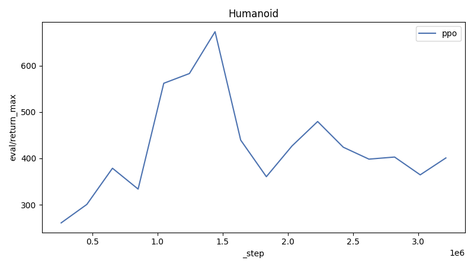

# Report

| Environment | ppo | vmpo | mpo |
|---|---|---|---|
| Humanoid | [401](https://wandb.ai/adrian-research/env-ppo/runs/b7zd20e3) | - | - |

## Humanoid



**ppo config:**

```json
{
  "clip_ratio": 0.15,
  "command": "ppo",
  "critic_layer_sizes": [
    512,
    256,
    256
  ],
  "ent_coef": 0.0003,
  "env": "Humanoid-v5",
  "eval_interval": 25000,
  "gae_lambda": 0.95,
  "gamma": 0.99,
  "max_grad_norm": 0.5,
  "minibatch_size": 512,
  "normalize_obs": true,
  "num_envs": 8,
  "out_dir": "checkpoints/ppo/Humanoid-v5",
  "policy_layer_sizes": [
    256,
    256,
    256
  ],
  "policy_lr": 0.0001,
  "rollout_steps": 8192,
  "save_interval": 1000000,
  "seed": 42,
  "target_kl": 0.02,
  "total_steps": 10000000,
  "update_epochs": 12,
  "value_lr": 2e-05,
  "vf_coef": 0.5,
  "wandb_entity": null,
  "wandb_group": null,
  "wandb_project": null
}
```

| Run | Algorithm | _step | eval/return_max |
|---|---|---:|---:|
| [ppo-Humanoid-v5](https://wandb.ai/adrian-research/env-ppo/runs/b7zd20e3) | ppo | 3263977 | 401 |
| [ppo-Humanoid-v5](https://wandb.ai/adrian-research/env-ppo/runs/a6v3w2nb) | ppo | 309657 | 260 |

