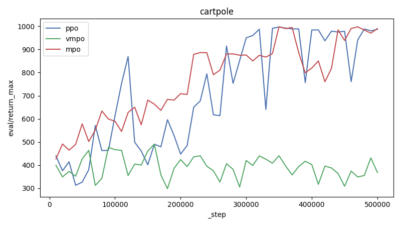
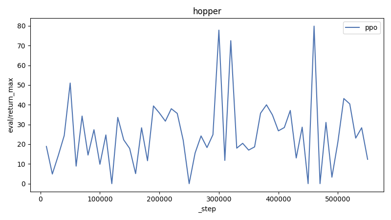
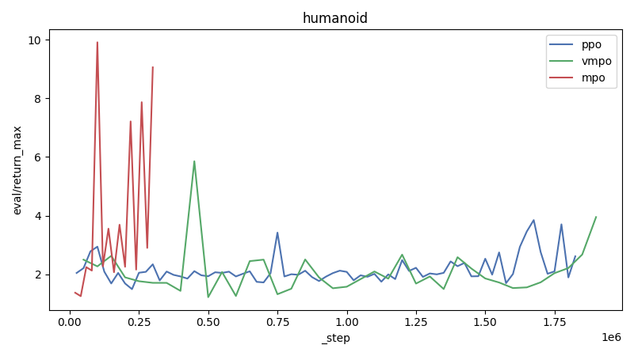

# Report

| Environment | ppo | vmpo | mpo |
|---|---|---|---|
| cartpole | [986](https://wandb.ai/adrian-research/dm_control-ppo/runs/a4cb2u94) | [368](https://wandb.ai/adrian-research/dm_control-vmpo/runs/cxjv49hs) | [990](https://wandb.ai/adrian-research/dm_control-mpo/runs/hi07qt8j) |
| cheetah | [655](https://wandb.ai/adrian-research/dm_control-ppo/runs/lx2y32lk) | [282](https://wandb.ai/adrian-research/dm_control-vmpo/runs/u7121rwm) | [301](https://wandb.ai/adrian-research/dm_control-mpo/runs/7lywk9l2) |
| hopper | [12](https://wandb.ai/adrian-research/dm_control-ppo/runs/t39lvty1) | - | - |
| humanoid | [2](https://wandb.ai/adrian-research/dm_control-ppo/runs/58mdez4x) | [3](https://wandb.ai/adrian-research/dm_control-vmpo/runs/cuozwby0) | [9](https://wandb.ai/adrian-research/dm_control-mpo/runs/el5x753m) |
| walker | [552](https://wandb.ai/adrian-research/dm_control-ppo/runs/z3cgkc8p) | [245](https://wandb.ai/adrian-research/dm_control-vmpo/runs/sy35a3f8) | [857](https://wandb.ai/adrian-research/dm_control-mpo/runs/tovs64he) |

## cartpole



**ppo config:**

```json
{
  "algo": "ppo",
  "batch_size": 256,
  "domain": "cartpole",
  "eval_interval": 10000,
  "hidden_sizes": [
    256,
    256
  ],
  "out_dir": "checkpoints",
  "replay_size": 1000000,
  "save_interval": 50000,
  "seed": 42,
  "start_steps": 10000,
  "task": "balance",
  "total_steps": 500000,
  "update_after": 1000,
  "updates_per_step": 4,
  "wandb_entity": null,
  "wandb_group": null,
  "wandb_project": null
}
```

**vmpo config:**

```json
{
  "batch_size": 256,
  "command": "vmpo",
  "domain": "cartpole",
  "eval_interval": 10000,
  "hidden_sizes": [
    256,
    256
  ],
  "out_dir": "checkpoints",
  "ppo_clip_ratio": 0.2,
  "ppo_ent_coef": 0.001,
  "ppo_max_grad_norm": 0.5,
  "ppo_minibatch_size": 128,
  "ppo_normalize_obs": true,
  "ppo_policy_lr": 0.0002,
  "ppo_rollout_steps": 4096,
  "ppo_target_kl": 0.02,
  "ppo_update_epochs": 6,
  "ppo_value_lr": 5e-05,
  "ppo_vf_coef": 0.5,
  "replay_size": 1000000,
  "save_interval": 50000,
  "seed": 42,
  "start_steps": 10000,
  "task": "balance",
  "total_steps": 500000,
  "update_after": 1000,
  "updates_per_step": 4,
  "vmpo_rollout_steps": 4096,
  "wandb_entity": null,
  "wandb_group": null,
  "wandb_project": null
}
```

**mpo config:**

```json
{
  "algo": "mpo",
  "batch_size": 256,
  "domain": "cartpole",
  "eval_interval": 10000,
  "hidden_sizes": [
    256,
    256
  ],
  "out_dir": "checkpoints",
  "replay_size": 1000000,
  "save_interval": 50000,
  "seed": 42,
  "start_steps": 10000,
  "task": "balance",
  "total_steps": 500000,
  "update_after": 1000,
  "updates_per_step": 4,
  "wandb_entity": null,
  "wandb_group": null,
  "wandb_project": null
}
```

| Run | Algorithm | _step | eval/return_max |
|---|---|---:|---:|
| [mpo-cartpole-balance](https://wandb.ai/adrian-research/dm_control-mpo/runs/hi07qt8j) | mpo | 500000 | 990 |
| [mpo-cartpole-balance](https://wandb.ai/adrian-research/dm_control-mpo/runs/avqd8inr) | mpo | 111461 | 436 |
| [mpo-cartpole-swingup](https://wandb.ai/adrian-research/dm_control-mpo/runs/0rd02xos) | mpo | 100638 | 110 |
| [mpo-cartpole-swingup](https://wandb.ai/adrian-research/dm_control-mpo/runs/r3dakaqj) | mpo | 100405 | 34 |
| [mpo-cartpole-swingup](https://wandb.ai/adrian-research/dm_control-mpo/runs/n8pensxm) | mpo | 80000 | 30 |
| [mpo-cartpole-swingup](https://wandb.ai/adrian-research/dm_control-mpo/runs/zkwnoalu) | mpo | 106228 | 29 |
| [mpo-cartpole-swingup](https://wandb.ai/adrian-research/dm_control-mpo/runs/34lt5n20) | mpo | 101164 | 0 |
| [mpo-cartpole-swingup](https://wandb.ai/adrian-research/dm_control-mpo/runs/ohwedcoo) | mpo | 57000 | 0 |
| [ppo-cartpole-balance](https://wandb.ai/adrian-research/dm_control-ppo/runs/a4cb2u94) | ppo | 500000 | 986 |
| [ppo-cartpole-swingup](https://wandb.ai/adrian-research/dm_control-ppo/runs/x996qip3) | ppo | 415000 | 82 |
| [vmpo-cartpole-balance](https://wandb.ai/adrian-research/dm_control-vmpo/runs/cxjv49hs) | vmpo | 500000 | 368 |
| [vmpo-cartpole-swingup](https://wandb.ai/adrian-research/dm_control-vmpo/runs/7da3cyrk) | vmpo | 1349632 | 341 |
| [vmpo-cartpole-balance](https://wandb.ai/adrian-research/dm_control-vmpo/runs/7kmqr7k1) | vmpo | 500000 | 309 |
| [vmpo-cartpole-swingup](https://wandb.ai/adrian-research/dm_control-vmpo/runs/zdyq372t) | vmpo | 593920 | 207 |
| [vmpo-cartpole-balance](https://wandb.ai/adrian-research/dm_control-vmpo/runs/3zazmifd) | vmpo | 500000 | 155 |
| [vmpo-cartpole-swingup](https://wandb.ai/adrian-research/dm_control-vmpo/runs/3sdcphf0) | vmpo | 560000 | 135 |
| [vmpo-cartpole-swingup](https://wandb.ai/adrian-research/dm_control-vmpo/runs/vgigtl2j) | vmpo | 800000 | 93 |
| [vmpo-cartpole-balance](https://wandb.ai/adrian-research/dm_control-vmpo/runs/x026g41w) | vmpo | 500000 | - |

## cheetah


**ppo config:**

```json
{
  "clip_ratio": 0.25,
  "command": "ppo",
  "critic_layer_sizes": [
    256,
    256,
    256
  ],
  "domain": "cheetah",
  "ent_coef": 0.0001,
  "eval_interval": 10000,
  "gae_lambda": 0.95,
  "gamma": 0.99,
  "max_grad_norm": 0.5,
  "minibatch_size": 256,
  "normalize_obs": true,
  "num_envs": 4,
  "out_dir": "checkpoints/ppo/cheetah/run",
  "policy_layer_sizes": [
    256,
    256,
    256
  ],
  "policy_lr": 0.0002,
  "rollout_steps": 2048,
  "save_interval": 1000000,
  "seed": 42,
  "target_kl": 0.02,
  "task": "run",
  "total_steps": 3000000,
  "update_epochs": 4,
  "value_lr": 0.0003,
  "vf_coef": 1,
  "wandb_entity": null,
  "wandb_group": null,
  "wandb_project": null
}
```

**vmpo config:**

```json
{
  "batch_size": 256,
  "command": "vmpo",
  "domain": "cheetah",
  "eval_interval": 10000,
  "hidden_sizes": [
    256,
    256
  ],
  "out_dir": "checkpoints",
  "ppo_clip_ratio": 0.2,
  "ppo_ent_coef": 0.001,
  "ppo_max_grad_norm": 0.5,
  "ppo_minibatch_size": 128,
  "ppo_normalize_obs": true,
  "ppo_policy_lr": 0.0002,
  "ppo_rollout_steps": 4096,
  "ppo_target_kl": 0.02,
  "ppo_update_epochs": 6,
  "ppo_value_lr": 5e-05,
  "ppo_vf_coef": 0.5,
  "replay_size": 1000000,
  "save_interval": 50000,
  "seed": 42,
  "start_steps": 10000,
  "task": "run",
  "total_steps": 10000000,
  "update_after": 1000,
  "updates_per_step": 10,
  "vmpo_rollout_steps": 4096,
  "wandb_entity": null,
  "wandb_group": null,
  "wandb_project": null
}
```

**mpo config:**

```json
{
  "action_samples": 64,
  "alpha_lr": 0.001,
  "automatic_entropy_tuning": true,
  "batch_size": 256,
  "clip_ratio": 0.2,
  "command": "mpo",
  "critic_layer_sizes": [
    512,
    512,
    256
  ],
  "domain": "cheetah",
  "ent_coef": 0.001,
  "epsilon_eta": 0.1,
  "epsilon_mu": 0.01,
  "epsilon_sigma": 0.0001,
  "eta": 5,
  "eta_init": 1,
  "eta_lr": 0.0003,
  "eval_interval": 10000,
  "gae_lambda": 0.95,
  "gamma": 0.995,
  "kl_epsilon": 0.2,
  "lambda_init": 1,
  "lambda_lr": 0.0003,
  "max_grad_norm": 1,
  "minibatch_size": 64,
  "mstep_kl_epsilon": 0.1,
  "normalize_obs": false,
  "num_envs": 1,
  "out_dir": "checkpoints",
  "policy_layer_sizes": [
    256,
    256,
    256
  ],
  "policy_lr": 0.0003,
  "q_lr": 0.0003,
  "replay_size": 1000000,
  "retrace_mc_actions": 8,
  "retrace_steps": 2,
  "rollout_steps": 4096,
  "save_interval": 1000000,
  "seed": 42,
  "start_steps": 10000,
  "target_kl": 0.02,
  "task": "run",
  "tau": 0.005,
  "topk_fraction": 1,
  "total_steps": 10000000,
  "update_after": 1000,
  "update_epochs": 10,
  "updates_per_step": 4,
  "use_retrace": true,
  "user_retrace": true,
  "value_lr": 0.0001,
  "vf_coef": 0.5,
  "wandb_entity": null,
  "wandb_group": null,
  "wandb_project": null
}
```

| Run | Algorithm | _step | eval/return_max |
|---|---|---:|---:|
| [mpo-cheetah-run](https://wandb.ai/adrian-research/dm_control-mpo/runs/7lywk9l2) | mpo | 130855 | 301 |
| [mpo-cheetah-run](https://wandb.ai/adrian-research/dm_control-mpo/runs/oezxglpr) | mpo | 155658 | 280 |
| [mpo-cheetah-run](https://wandb.ai/adrian-research/dm_control-mpo/runs/ok6xtteg) | mpo | 500000 | 70 |
| [mpo-cheetah-run](https://wandb.ai/adrian-research/dm_control-mpo/runs/hq3em7cu) | mpo | 229137 | 0 |
| [ppo-cheetah-run](https://wandb.ai/adrian-research/dm_control-ppo/runs/lx2y32lk) | ppo | 3000000 | 655 |
| [ppo-cheetah-run](https://wandb.ai/adrian-research/dm_control-ppo/runs/pc3yc663) | ppo | 1529521 | 486 |
| [ppo-cheetah-run](https://wandb.ai/adrian-research/dm_control-ppo/runs/3q91vgh6) | ppo | 1880000 | 370 |
| [ppo-cheetah-run](https://wandb.ai/adrian-research/dm_control-ppo/runs/7csw9xnv) | ppo | 1390000 | 368 |
| [ppo-cheetah-run-GOOD](https://wandb.ai/adrian-research/dm_control-ppo/runs/fqbzbouu) | ppo | 3000000 | 346 |
| [ppo-cheetah-run](https://wandb.ai/adrian-research/dm_control-ppo/runs/l21ohjoi) | ppo | 1786000 | 187 |
| [ppo-cheetah-run](https://wandb.ai/adrian-research/dm_control-ppo/runs/kspidy3x) | ppo | 1000000 | 162 |
| [ppo-cheetah-run](https://wandb.ai/adrian-research/dm_control-ppo/runs/zqermdwk) | ppo | 3000000 | 114 |
| [ppo-cheetah-run](https://wandb.ai/adrian-research/dm_control-ppo/runs/yq5f9194) | ppo | 479232 | 106 |
| [ppo-cheetah-run](https://wandb.ai/adrian-research/dm_control-ppo/runs/tdcz6om7) | ppo | 960000 | 85 |
| [ppo-cheetah-run](https://wandb.ai/adrian-research/dm_control-ppo/runs/5y4jnojb) | ppo | 500000 | 82 |
| [ppo-cheetah-run](https://wandb.ai/adrian-research/dm_control-ppo/runs/23khve99) | ppo | 1000000 | 76 |
| [ppo-cheetah-run](https://wandb.ai/adrian-research/dm_control-ppo/runs/55r2mxt7) | ppo | 500000 | 16 |
| [ppo-cheetah-run](https://wandb.ai/adrian-research/dm_control-ppo/runs/twhjj7kr) | ppo | 500000 | 14 |
| [ppo-cheetah-run](https://wandb.ai/adrian-research/dm_control-ppo/runs/5mudgely) | ppo | 310000 | 14 |
| [ppo-cheetah-run](https://wandb.ai/adrian-research/dm_control-ppo/runs/oo9sgu5t) | ppo | 880879 | - |
| [ppo-cheetah-run](https://wandb.ai/adrian-research/dm_control-ppo/runs/d4rzaspv) | ppo | 872448 | - |
| [ppo-cheetah-run](https://wandb.ai/adrian-research/dm_control-ppo/runs/t0nqsar8) | ppo | 980973 | - |
| [ppo-cheetah-run](https://wandb.ai/adrian-research/dm_control-ppo/runs/c07j2024) | ppo | 106496 | - |
| [ppo-cheetah-run](https://wandb.ai/adrian-research/dm_control-ppo/runs/er9xpzpz) | ppo | 458752 | - |
| [vmpo-cheetah-run](https://wandb.ai/adrian-research/dm_control-vmpo/runs/u7121rwm) | vmpo | 7800000 | 282 |
| [vmpo-cheetah-run](https://wandb.ai/adrian-research/dm_control-vmpo/runs/2tgwo7b1) | vmpo | 8492000 | 238 |
| [vmpo-cheetah-run](https://wandb.ai/adrian-research/dm_control-vmpo/runs/t16tin48) | vmpo | 1802240 | 238 |
| [vmpo-cheetah-run](https://wandb.ai/adrian-research/dm_control-vmpo/runs/i6nzjm2e) | vmpo | 1980000 | 223 |
| [vmpo-cheetah-run](https://wandb.ai/adrian-research/dm_control-vmpo/runs/ntj9aaaa) | vmpo | 812000 | 215 |
| [vmpo-cheetah-run](https://wandb.ai/adrian-research/dm_control-vmpo/runs/ly3ch3dg) | vmpo | 2481000 | 200 |
| [vmpo-cheetah-run](https://wandb.ai/adrian-research/dm_control-vmpo/runs/3t0qvigc) | vmpo | 1564672 | 200 |
| [vmpo-cheetah-run-OKAY](https://wandb.ai/adrian-research/dm_control-vmpo/runs/sjpsyxt4) | vmpo | 4681728 | 196 |
| [vmpo-cheetah-run](https://wandb.ai/adrian-research/dm_control-vmpo/runs/txl8wa5g) | vmpo | 1081000 | 196 |
| [vmpo-cheetah-run](https://wandb.ai/adrian-research/dm_control-vmpo/runs/g5iqhq70) | vmpo | 2473000 | 188 |
| [vmpo-cheetah-run](https://wandb.ai/adrian-research/dm_control-vmpo/runs/0ntt11b0) | vmpo | 1605000 | 184 |
| [vmpo-cheetah-run](https://wandb.ai/adrian-research/dm_control-vmpo/runs/e2yr3kdq) | vmpo | 5278000 | 178 |
| [vmpo-cheetah-run](https://wandb.ai/adrian-research/dm_control-vmpo/runs/4i7yjzq9) | vmpo | 1721000 | 177 |
| [vmpo-cheetah-run](https://wandb.ai/adrian-research/dm_control-vmpo/runs/ch30yep2) | vmpo | 3389000 | 176 |
| [vmpo-cheetah-run](https://wandb.ai/adrian-research/dm_control-vmpo/runs/ohdisg4i) | vmpo | 666665 | 172 |
| [vmpo-cheetah-run](https://wandb.ai/adrian-research/dm_control-vmpo/runs/beho29hz) | vmpo | 1108000 | 171 |
| [vmpo-cheetah-run](https://wandb.ai/adrian-research/dm_control-vmpo/runs/z99hz1l0) | vmpo | 3500000 | 168 |
| [vmpo-cheetah-run](https://wandb.ai/adrian-research/dm_control-vmpo/runs/mcc1y69i) | vmpo | 1979976 | 161 |
| [vmpo-cheetah-run](https://wandb.ai/adrian-research/dm_control-vmpo/runs/0yuez6kj) | vmpo | 828000 | 155 |
| [vmpo-cheetah-run](https://wandb.ai/adrian-research/dm_control-vmpo/runs/gr5j8msb) | vmpo | 3522560 | 153 |
| [vmpo-cheetah-run](https://wandb.ai/adrian-research/dm_control-vmpo/runs/vcgit2nw) | vmpo | 569000 | 150 |
| [vmpo-cheetah-run](https://wandb.ai/adrian-research/dm_control-vmpo/runs/wvpmam25) | vmpo | 609000 | 145 |
| [vmpo-cheetah-run](https://wandb.ai/adrian-research/dm_control-vmpo/runs/apvf0e0h) | vmpo | 225000 | 145 |
| [vmpo-cheetah-run](https://wandb.ai/adrian-research/dm_control-vmpo/runs/v1r4pbn6) | vmpo | 10000000 | 145 |
| [vmpo-cheetah-run](https://wandb.ai/adrian-research/dm_control-vmpo/runs/0znvqczi) | vmpo | 5111000 | 143 |
| [vmpo-cheetah-run](https://wandb.ai/adrian-research/dm_control-vmpo/runs/z9tbsxwc) | vmpo | 1510000 | 141 |
| [vmpo-cheetah-run](https://wandb.ai/adrian-research/dm_control-vmpo/runs/x9aotdjr) | vmpo | 1276000 | 138 |
| [vmpo-cheetah-run](https://wandb.ai/adrian-research/dm_control-vmpo/runs/9lgbyiv9) | vmpo | 500000 | 130 |
| [vmpo-cheetah-run](https://wandb.ai/adrian-research/dm_control-vmpo/runs/z3v9fncd) | vmpo | 835000 | 127 |
| [vmpo-cheetah-run](https://wandb.ai/adrian-research/dm_control-vmpo/runs/mjcm4k2o) | vmpo | 406404 | 126 |
| [vmpo-cheetah-run](https://wandb.ai/adrian-research/dm_control-vmpo/runs/5k5gjvbm) | vmpo | 500000 | 125 |
| [vmpo-cheetah-run](https://wandb.ai/adrian-research/dm_control-vmpo/runs/z5qjy1pu) | vmpo | 387000 | 123 |
| [vmpo-cheetah-run](https://wandb.ai/adrian-research/dm_control-vmpo/runs/kp7hdx3n) | vmpo | 1699000 | 111 |
| [vmpo-cheetah-run](https://wandb.ai/adrian-research/dm_control-vmpo/runs/7rubat3x) | vmpo | 1750000 | 109 |
| [vmpo-cheetah-run](https://wandb.ai/adrian-research/dm_control-vmpo/runs/1edmhni4) | vmpo | 500000 | 102 |
| [vmpo-cheetah-run](https://wandb.ai/adrian-research/dm_control-vmpo/runs/ggbam8dl) | vmpo | 942080 | 99 |
| [vmpo-cheetah-run](https://wandb.ai/adrian-research/dm_control-vmpo/runs/eonwabcc) | vmpo | 960952 | 96 |
| [vmpo-cheetah-run](https://wandb.ai/adrian-research/dm_control-vmpo/runs/co91b2oy) | vmpo | 1420000 | 96 |
| [vmpo-cheetah-run](https://wandb.ai/adrian-research/dm_control-vmpo/runs/9x1hu01h) | vmpo | 540672 | 95 |
| [vmpo-cheetah-run](https://wandb.ai/adrian-research/dm_control-vmpo/runs/o7e4vi7q) | vmpo | 206000 | 88 |
| [vmpo-cheetah-run](https://wandb.ai/adrian-research/dm_control-vmpo/runs/h52r01bq) | vmpo | 565248 | 83 |
| [vmpo-cheetah-run](https://wandb.ai/adrian-research/dm_control-vmpo/runs/plqej52m) | vmpo | 384000 | 80 |
| [vmpo-cheetah-run](https://wandb.ai/adrian-research/dm_control-vmpo/runs/4f823uxn) | vmpo | 1153000 | 77 |
| [vmpo-cheetah-run](https://wandb.ai/adrian-research/dm_control-vmpo/runs/pxwbta1g) | vmpo | 1600000 | 77 |
| [vmpo-cheetah-run](https://wandb.ai/adrian-research/dm_control-vmpo/runs/f0p6nohk) | vmpo | 1706000 | 63 |
| [vmpo-cheetah-run](https://wandb.ai/adrian-research/dm_control-vmpo/runs/9yeqg060) | vmpo | 1250000 | 57 |
| [vmpo-cheetah-run](https://wandb.ai/adrian-research/dm_control-vmpo/runs/5s5kguuc) | vmpo | 50000 | 43 |
| [vmpo-cheetah-run](https://wandb.ai/adrian-research/dm_control-vmpo/runs/4y8tfpst) | vmpo | 604000 | 34 |
| [vmpo-cheetah-run](https://wandb.ai/adrian-research/dm_control-vmpo/runs/wuecd6us) | vmpo | 98304 | 11 |
| [vmpo-cheetah-run](https://wandb.ai/adrian-research/dm_control-vmpo/runs/mq1aysxf) | vmpo | 500000 | 10 |
| [vmpo-cheetah-run](https://wandb.ai/adrian-research/dm_control-vmpo/runs/i7outjlu) | vmpo | 436000 | 9 |
| [vmpo-cheetah-run](https://wandb.ai/adrian-research/dm_control-vmpo/runs/uq39792v) | vmpo | 992960 | 5 |
| [vmpo-cheetah-run](https://wandb.ai/adrian-research/dm_control-vmpo/runs/l8t5xz8n) | vmpo | 2150016 | 5 |
| [vmpo-cheetah-run](https://wandb.ai/adrian-research/dm_control-vmpo/runs/6r0q7rn1) | vmpo | 150000 | 4 |
| [vmpo-cheetah-run](https://wandb.ai/adrian-research/dm_control-vmpo/runs/x1z9skk3) | vmpo | 125000 | 4 |
| [vmpo-cheetah-run](https://wandb.ai/adrian-research/dm_control-vmpo/runs/sgg0ljdf) | vmpo | 1137120 | 3 |
| [vmpo-cheetah-run](https://wandb.ai/adrian-research/dm_control-vmpo/runs/hrkf46m9) | vmpo | 673000 | 2 |
| [vmpo-cheetah-run](https://wandb.ai/adrian-research/dm_control-vmpo/runs/6uyzvg39) | vmpo | 1729696 | 1 |
| [vmpo-cheetah-run](https://wandb.ai/adrian-research/dm_control-vmpo/runs/crjsyt89) | vmpo | 258256 | 0 |
| [vmpo-cheetah-run](https://wandb.ai/adrian-research/dm_control-vmpo/runs/8v0ciw65) | vmpo | 95090 | 0 |
| [vmpo-cheetah-run](https://wandb.ai/adrian-research/dm_control-vmpo/runs/ixcyxgeq) | vmpo | 220215 | 0 |

## hopper



**ppo config:**

```json
{
  "action_samples": 16,
  "alpha_lr": 0.001,
  "automatic_entropy_tuning": true,
  "batch_size": 256,
  "clip_ratio": 0.2,
  "command": "ppo",
  "domain": "hopper",
  "ent_coef": 0.0002,
  "epsilon_eta": 0.1,
  "epsilon_mu": 0.01,
  "epsilon_sigma": 0.0001,
  "eta": 5,
  "eta_init": 1,
  "eta_lr": 0.001,
  "eval_interval": 10000,
  "gae_lambda": 0.95,
  "gamma": 0.99,
  "hidden_sizes": [
    256,
    256
  ],
  "kl_epsilon": 0.1,
  "kl_mean_coef": 0.001,
  "kl_std_coef": 0.001,
  "lambda_init": 1,
  "lambda_lr": 0.001,
  "max_grad_norm": 0.5,
  "minibatch_size": 128,
  "mstep_kl_epsilon": 0.1,
  "normalize_obs": true,
  "out_dir": "checkpoints",
  "policy_lr": 0.0003,
  "q_lr": 0.0003,
  "replay_size": 1000000,
  "retrace_mc_actions": 16,
  "retrace_steps": 5,
  "rollout_steps": 2048,
  "save_interval": 50000,
  "seed": 42,
  "start_steps": 10000,
  "target_kl": 0.02,
  "task": "stand",
  "tau": 0.005,
  "topk_fraction": 1,
  "total_steps": 2000000,
  "update_after": 1000,
  "update_epochs": 10,
  "updates_per_step": 4,
  "value_lr": 0.0001,
  "vf_coef": 0.5,
  "wandb_entity": null,
  "wandb_group": null,
  "wandb_project": null
}
```

| Run | Algorithm | _step | eval/return_max |
|---|---|---:|---:|
| [ppo-hopper-stand](https://wandb.ai/adrian-research/dm_control-ppo/runs/t39lvty1) | ppo | 550000 | 12 |
| [ppo-hopper-hop](https://wandb.ai/adrian-research/dm_control-ppo/runs/wrva4s3v) | ppo | 150000 | 0 |
| [ppo-hopper-hop](https://wandb.ai/adrian-research/dm_control-ppo/runs/w4mzpyqc) | ppo | 280000 | 0 |
| [ppo-hopper-hop](https://wandb.ai/adrian-research/dm_control-ppo/runs/cy60z83m) | ppo | 790000 | 0 |
| [ppo-hopper-hop](https://wandb.ai/adrian-research/dm_control-ppo/runs/vfuwe99u) | ppo | 989184 | 0 |
| [ppo-hopper-hop](https://wandb.ai/adrian-research/dm_control-ppo/runs/i9k0huss) | ppo | 280000 | 0 |

## humanoid



**ppo config:**

```json
{
  "action_samples": 16,
  "alpha_lr": 0.001,
  "automatic_entropy_tuning": true,
  "batch_size": 256,
  "clip_ratio": 0.15,
  "command": "ppo",
  "domain": "humanoid",
  "ent_coef": 0.0003,
  "epsilon_eta": 0.1,
  "epsilon_mu": 0.01,
  "epsilon_sigma": 0.0001,
  "eta": 5,
  "eta_init": 1,
  "eta_lr": 0.001,
  "eval_interval": 25000,
  "gae_lambda": 0.95,
  "gamma": 0.99,
  "hidden_sizes": [
    256,
    256
  ],
  "kl_epsilon": 0.1,
  "kl_mean_coef": 0.001,
  "kl_std_coef": 0.001,
  "lambda_init": 1,
  "lambda_lr": 0.001,
  "max_grad_norm": 0.5,
  "minibatch_size": 512,
  "mstep_kl_epsilon": 0.1,
  "normalize_obs": true,
  "out_dir": "checkpoints",
  "policy_lr": 0.0001,
  "q_lr": 0.0003,
  "replay_size": 1000000,
  "retrace_mc_actions": 16,
  "retrace_steps": 5,
  "rollout_steps": 8192,
  "save_interval": 100000,
  "seed": 42,
  "start_steps": 10000,
  "target_kl": 0.02,
  "task": "run",
  "tau": 0.005,
  "topk_fraction": 1,
  "total_steps": 10000000,
  "update_after": 1000,
  "update_epochs": 12,
  "updates_per_step": 4,
  "value_lr": 2e-05,
  "vf_coef": 0.5,
  "wandb_entity": null,
  "wandb_group": null,
  "wandb_project": null
}
```

**vmpo config:**

```json
{
  "action_samples": 16,
  "alpha_lr": 0.0001,
  "automatic_entropy_tuning": true,
  "batch_size": 256,
  "clip_ratio": 0.2,
  "command": "vmpo",
  "domain": "humanoid",
  "ent_coef": 0.001,
  "epsilon_eta": 0.3,
  "epsilon_mu": 0.05,
  "epsilon_sigma": 0.0003,
  "eta": 10,
  "eta_init": 1,
  "eta_lr": 0.0005,
  "eval_interval": 50000,
  "gae_lambda": 0.95,
  "gamma": 0.995,
  "hidden_sizes": [
    1024,
    512
  ],
  "kl_epsilon": 0.1,
  "kl_mean_coef": 0.001,
  "kl_std_coef": 0.001,
  "lambda_init": 1,
  "lambda_lr": 0.001,
  "max_grad_norm": 0.5,
  "minibatch_size": 64,
  "mstep_kl_epsilon": 0.1,
  "normalize_obs": false,
  "num_envs": 32,
  "out_dir": "checkpoints",
  "policy_lr": 5e-05,
  "q_lr": 0.0003,
  "replay_size": 1000000,
  "retrace_mc_actions": 16,
  "retrace_steps": 5,
  "rollout_steps": 16384,
  "save_interval": 1000000,
  "seed": 42,
  "start_steps": 10000,
  "target_kl": 0.02,
  "task": "walk",
  "tau": 0.005,
  "topk_fraction": 0.6,
  "total_steps": 30000000,
  "update_after": 1000,
  "update_epochs": 1,
  "updates_per_step": 4,
  "value_lr": 0.0001,
  "vf_coef": 0.5,
  "wandb_entity": null,
  "wandb_group": null,
  "wandb_project": null
}
```

**mpo config:**

```json
{
  "action_penalization": false,
  "action_samples": 256,
  "batch_size": 512,
  "command": "mpo",
  "critic_layer_sizes": [
    512,
    256,
    256
  ],
  "domain": "humanoid",
  "epsilon_mean": null,
  "epsilon_penalty": 0.001,
  "epsilon_stddev": null,
  "eval_interval": 20000,
  "gamma": 0.995,
  "kl_epsilon": 0.1,
  "lambda_init": 1,
  "lambda_lr": 0.0003,
  "max_grad_norm": 1,
  "mstep_kl_epsilon": 0.1,
  "out_dir": "checkpoints/mpo/humanoid/walk",
  "per_dim_constraining": false,
  "policy_layer_sizes": [
    256,
    256,
    256
  ],
  "policy_lr": 0.0003,
  "q_lr": 0.0003,
  "replay_size": 1000000,
  "retrace_lambda": 0.95,
  "retrace_mc_actions": 8,
  "retrace_steps": 3,
  "save_interval": 50000,
  "seed": 42,
  "task": "walk",
  "tau": 0.005,
  "temperature_init": 5,
  "temperature_lr": 0.0003,
  "total_steps": 40000000,
  "update_after": 2000,
  "updates_per_step": 1,
  "use_retrace": true,
  "wandb_entity": null,
  "wandb_group": null,
  "wandb_project": null
}
```

| Run | Algorithm | _step | eval/return_max |
|---|---|---:|---:|
| [mpo-humanoid-walk](https://wandb.ai/adrian-research/dm_control-mpo/runs/el5x753m) | mpo | 306371 | 9 |
| [mpo-humanoid-walk](https://wandb.ai/adrian-research/dm_control-mpo/runs/mpp3qvxc) | mpo | 326768 | 3 |
| [mpo-humanoid-walk](https://wandb.ai/adrian-research/dm_control-mpo/runs/8el493ig) | mpo | 195177 | 3 |
| [mpo-humanoid-run](https://wandb.ai/adrian-research/dm_control-mpo/runs/ihu36xlw) | mpo | 511570 | 3 |
| [mpo-humanoid-run](https://wandb.ai/adrian-research/dm_control-mpo/runs/7vc2u4ju) | mpo | 162958 | 3 |
| [mpo-humanoid-walk](https://wandb.ai/adrian-research/dm_control-mpo/runs/iznchba3) | mpo | 193695 | 2 |
| [mpo-humanoid-walk](https://wandb.ai/adrian-research/dm_control-mpo/runs/t97mpglm) | mpo | 464017 | 2 |
| [mpo-humanoid-walk](https://wandb.ai/adrian-research/dm_control-mpo/runs/slc9084s) | mpo | 130233 | 2 |
| [mpo-humanoid-run](https://wandb.ai/adrian-research/dm_control-mpo/runs/e3g1k7su) | mpo | 66893 | 1 |
| [mpo-humanoid-run](https://wandb.ai/adrian-research/dm_control-mpo/runs/viz57nig) | mpo | 65573 | 1 |
| [mpo-humanoid-run](https://wandb.ai/adrian-research/dm_control-mpo/runs/hm0fajr9) | mpo | 1034921 | 1 |
| [mpo-humanoid-run](https://wandb.ai/adrian-research/dm_control-mpo/runs/eo1r0ga7) | mpo | 464487 | 1 |
| [mpo-humanoid-run](https://wandb.ai/adrian-research/dm_control-mpo/runs/uvq3pi61) | mpo | 117508 | 1 |
| [ppo-humanoid-run](https://wandb.ai/adrian-research/dm_control-ppo/runs/58mdez4x) | ppo | 1850000 | 2 |
| [ppo-humanoid-walk](https://wandb.ai/adrian-research/dm_control-ppo/runs/9cp6i0vt) | ppo | 400000 | 2 |
| [ppo-humanoid-walk](https://wandb.ai/adrian-research/dm_control-ppo/runs/budy2enr) | ppo | 310000 | 2 |
| [ppo-humanoid-walk](https://wandb.ai/adrian-research/dm_control-ppo/runs/lvw0p10j) | ppo | 5000000 | 1 |
| [ppo-humanoid-walk](https://wandb.ai/adrian-research/dm_control-ppo/runs/1u3vasti) | ppo | 528513 | 1 |
| [ppo-humanoid-walk](https://wandb.ai/adrian-research/dm_control-ppo/runs/e7yobp24) | ppo | 1019000 | 1 |
| [ppo-humanoid-walk](https://wandb.ai/adrian-research/dm_control-ppo/runs/2tn7gq7u) | ppo | 247000 | 1 |
| [ppo-humanoid-walk](https://wandb.ai/adrian-research/dm_control-ppo/runs/lws3563i) | ppo | 58000 | - |
| [ppo-humanoid-walk](https://wandb.ai/adrian-research/dm_control-ppo/runs/gmq8eq8s) | ppo | 100000 | - |
| [ppo-humanoid-walk](https://wandb.ai/adrian-research/dm_control-ppo/runs/2ueiw2tv) | ppo | 58000 | - |
| [vmpo-humanoid-walk](https://wandb.ai/adrian-research/dm_control-vmpo/runs/cuozwby0) | vmpo | 1921888 | 3 |
| [vmpo-humanoid-walk](https://wandb.ai/adrian-research/dm_control-vmpo/runs/jzah9qu2) | vmpo | 2899000 | 2 |
| [vmpo-humanoid-walk](https://wandb.ai/adrian-research/dm_control-vmpo/runs/hsctou9q) | vmpo | 1456000 | 2 |
| [vmpo-humanoid-walk 20 --topk_fraction 0.3](https://wandb.ai/adrian-research/dm_control-vmpo/runs/ugnhh5zv) | vmpo | 3945000 | 2 |
| [vmpo-humanoid-walk](https://wandb.ai/adrian-research/dm_control-vmpo/runs/qjp74vll) | vmpo | 8484000 | 2 |
| [vmpo-humanoid-run](https://wandb.ai/adrian-research/dm_control-vmpo/runs/wzfgznvh) | vmpo | 996000 | 2 |
| [vmpo-humanoid-run-update_epochs-20-0.6](https://wandb.ai/adrian-research/dm_control-vmpo/runs/kznpar4v) | vmpo | 1099000 | 2 |
| [vmpo-humanoid-walk](https://wandb.ai/adrian-research/dm_control-vmpo/runs/74to3lef) | vmpo | 4900000 | 2 |
| [vmpo-humanoid-walk](https://wandb.ai/adrian-research/dm_control-vmpo/runs/opay1xa2) | vmpo | 81000 | 2 |
| [vmpo-humanoid-run](https://wandb.ai/adrian-research/dm_control-vmpo/runs/1brydjx2) | vmpo | 921000 | 2 |
| [vmpo-humanoid-walk](https://wandb.ai/adrian-research/dm_control-vmpo/runs/b1w32cd4) | vmpo | 20293000 | 2 |
| [vmpo-humanoid-walk --topk_fraction 0.6 --update_epochs 4](https://wandb.ai/adrian-research/dm_control-vmpo/runs/xaaariml) | vmpo | 5352000 | 2 |
| [vmpo-humanoid-run](https://wandb.ai/adrian-research/dm_control-vmpo/runs/3g5250wr) | vmpo | 1056000 | 2 |
| [vmpo-humanoid-walk](https://wandb.ai/adrian-research/dm_control-vmpo/runs/b02xev8d) | vmpo | 1249000 | 2 |
| [vmpo-humanoid-run](https://wandb.ai/adrian-research/dm_control-vmpo/runs/as9wpxgu) | vmpo | 2464000 | 1 |
| [vmpo-humanoid-run](https://wandb.ai/adrian-research/dm_control-vmpo/runs/lpb3ukrv) | vmpo | 26827000 | 1 |
| [vmpo-humanoid-run-multi-env](https://wandb.ai/adrian-research/dm_control-vmpo/runs/xw6ywn4x) | vmpo | 21350016 | 1 |
| [vmpo-humanoid-update_epochs-1-0.6](https://wandb.ai/adrian-research/dm_control-vmpo/runs/c37l3is2) | vmpo | 1114112 | 1 |
| [vmpo-humanoid-walk](https://wandb.ai/adrian-research/dm_control-vmpo/runs/y4ajvcg9) | vmpo | 3511000 | 1 |
| [vmpo-humanoid-run](https://wandb.ai/adrian-research/dm_control-vmpo/runs/9yd8fjvx) | vmpo | 2122000 | 1 |
| [vmpo-humanoid-walk--update_epochs 1 0.6](https://wandb.ai/adrian-research/dm_control-vmpo/runs/73aws0cb) | vmpo | 4150000 | 1 |
| [vmpo-humanoid-run](https://wandb.ai/adrian-research/dm_control-vmpo/runs/o0g5gsy4) | vmpo | 913000 | 1 |
| [vmpo-humanoid-run](https://wandb.ai/adrian-research/dm_control-vmpo/runs/5w74biud) | vmpo | 439000 | 1 |
| [vmpo-humanoid-walk](https://wandb.ai/adrian-research/dm_control-vmpo/runs/n5pnwi1u) | vmpo | 500000 | 1 |
| [vmpo-humanoid-run-update_epochs-4-0.6](https://wandb.ai/adrian-research/dm_control-vmpo/runs/zbqde1xo) | vmpo | 254000 | 1 |
| [vmpo-humanoid-run](https://wandb.ai/adrian-research/dm_control-vmpo/runs/yg4infje) | vmpo | 500000 | 1 |
| [vmpo-humanoid-run-update_epochs-20-0.3](https://wandb.ai/adrian-research/dm_control-vmpo/runs/c7a6h0hm) | vmpo | 1072000 | 1 |
| [vmpo-humanoid-walk](https://wandb.ai/adrian-research/dm_control-vmpo/runs/ab96uiyy) | vmpo | 3087000 | 1 |
| [vmpo-humanoid-run](https://wandb.ai/adrian-research/dm_control-vmpo/runs/kkes2lc3) | vmpo | 64032 | 1 |
| [vmpo-humanoid-run](https://wandb.ai/adrian-research/dm_control-vmpo/runs/hbfu5yzb) | vmpo | 256000 | 1 |
| [vmpo-humanoid-walk](https://wandb.ai/adrian-research/dm_control-vmpo/runs/fa675j34) | vmpo | 115000 | 1 |
| [vmpo-humanoid-walk-multi-env](https://wandb.ai/adrian-research/dm_control-vmpo/runs/zf2y0w32) | vmpo | 10154112 | 1 |
| [vmpo-humanoid-run](https://wandb.ai/adrian-research/dm_control-vmpo/runs/arldnflc) | vmpo | 1446000 | 1 |
| [vmpo-humanoid-run](https://wandb.ai/adrian-research/dm_control-vmpo/runs/ib97bbrj) | vmpo | 4033000 | 1 |
| [vmpo-humanoid-run](https://wandb.ai/adrian-research/dm_control-vmpo/runs/8qh68uni) | vmpo | 5701664 | 1 |
| [vmpo-humanoid-run](https://wandb.ai/adrian-research/dm_control-vmpo/runs/p3ov473f) | vmpo | 500000 | 1 |
| [vmpo-humanoid-run](https://wandb.ai/adrian-research/dm_control-vmpo/runs/6g06og2p) | vmpo | 500000 | 1 |
| [vmpo-humanoid-run](https://wandb.ai/adrian-research/dm_control-vmpo/runs/eybyibec) | vmpo | 500000 | 1 |
| [vmpo-humanoid-run](https://wandb.ai/adrian-research/dm_control-vmpo/runs/s1yld3zb) | vmpo | 561000 | 1 |

## walker


**ppo config:**

```json
{
  "clip_ratio": 0.2,
  "command": "ppo",
  "critic_layer_sizes": [
    512,
    256,
    256
  ],
  "domain": "walker",
  "ent_coef": 0.0001,
  "eval_interval": 10000,
  "gae_lambda": 0.95,
  "gamma": 0.99,
  "max_grad_norm": 0.5,
  "minibatch_size": 128,
  "normalize_obs": true,
  "num_envs": 4,
  "out_dir": "checkpoints/ppo/walker/walk",
  "policy_layer_sizes": [
    256,
    256,
    256
  ],
  "policy_lr": 0.0002,
  "rollout_steps": 2048,
  "save_interval": 100000,
  "seed": 42,
  "target_kl": 0.02,
  "task": "walk",
  "total_steps": 10000000,
  "update_epochs": 6,
  "value_lr": 0.0001,
  "vf_coef": 0.5,
  "wandb_entity": null,
  "wandb_group": null,
  "wandb_project": null
}
```

**vmpo config:**

```json
{
  "alpha_lr": 0.0005,
  "command": "vmpo",
  "domain": "walker",
  "epsilon_eta": 0.1,
  "epsilon_mu": 0.01,
  "epsilon_sigma": 0.0001,
  "eval_interval": 25000,
  "gamma": 0.99,
  "max_grad_norm": 0.5,
  "out_dir": "checkpoints/vmpo/walker/walk",
  "policy_layer_sizes": [
    512,
    512,
    256
  ],
  "policy_lr": 0.0003,
  "rollout_steps": 32768,
  "save_interval": 50000,
  "seed": 42,
  "task": "walk",
  "temperature_init": 3,
  "temperature_lr": 0.0005,
  "topk_fraction": 0.25,
  "total_steps": 3000000,
  "updates_per_step": 1,
  "value_lr": 0.0001,
  "wandb_entity": null,
  "wandb_group": null,
  "wandb_project": null
}
```

**mpo config:**

```json
{
  "action_penalization": false,
  "action_samples": 128,
  "batch_size": 512,
  "checkpoint": null,
  "command": "mpo",
  "critic_layer_sizes": [
    512,
    512,
    256
  ],
  "domain": "walker",
  "epsilon_mean": null,
  "epsilon_penalty": 0.001,
  "epsilon_stddev": null,
  "eta_init": 5,
  "eta_lr": 0.0003,
  "eval_interval": 20000,
  "gamma": 0.995,
  "generate_video": false,
  "kl_epsilon": 0.1,
  "lambda_init": 1,
  "lambda_lr": 0.0003,
  "max_grad_norm": 1,
  "mstep_kl_epsilon": 0.1,
  "out_dir": "checkpoints",
  "per_dim_constraining": true,
  "policy_layer_sizes": [
    256,
    256,
    256
  ],
  "policy_lr": 0.0003,
  "q_lr": 0.0003,
  "replay_size": 1000000,
  "retrace_lambda": 0.95,
  "retrace_mc_actions": 8,
  "retrace_steps": 2,
  "save_interval": 50000,
  "seed": 42,
  "task": "walk",
  "tau": 0.005,
  "total_steps": 30000000,
  "update_after": 2000,
  "use_retrace": true,
  "video_max_steps": 1000,
  "video_out": null,
  "wandb_entity": null,
  "wandb_group": null,
  "wandb_project": null
}
```

| Run | Algorithm | _step | eval/return_max |
|---|---|---:|---:|
| [mpo-walker-walk](https://wandb.ai/adrian-research/dm_control-mpo/runs/tovs64he) | mpo | 62152 | 857 |
| [mpo-walker-walk](https://wandb.ai/adrian-research/dm_control-mpo/runs/ej3rbqch) | mpo | 356753 | 787 |
| [mpo-walker-walk](https://wandb.ai/adrian-research/dm_control-mpo/runs/2yaebq3y) | mpo | 124645 | 657 |
| [mpo-walker-run](https://wandb.ai/adrian-research/dm_control-mpo/runs/n77n76jm) | mpo | 188111 | 488 |
| [mpo-walker-run](https://wandb.ai/adrian-research/dm_control-mpo/runs/pdu9eqhf) | mpo | 473312 | 481 |
| [mpo-walker-walk](https://wandb.ai/adrian-research/dm_control-mpo/runs/6urxdc2g) | mpo | 245772 | 25 |
| [ppo-walker-walk](https://wandb.ai/adrian-research/dm_control-ppo/runs/z3cgkc8p) | ppo | 4808797 | 552 |
| [ppo-walker-walk](https://wandb.ai/adrian-research/dm_control-ppo/runs/u8akrxyb) | ppo | 2216000 | 466 |
| [ppo-walker-walk](https://wandb.ai/adrian-research/dm_control-ppo/runs/sjhi12s8) | ppo | 1113000 | 456 |
| [ppo-walker-walk](https://wandb.ai/adrian-research/dm_control-ppo/runs/h35874u8) | ppo | 1265000 | 439 |
| [ppo-walker-run](https://wandb.ai/adrian-research/dm_control-ppo/runs/1dn3ez8y) | ppo | 5000000 | 268 |
| [ppo-walker-walk](https://wandb.ai/adrian-research/dm_control-ppo/runs/sxmgm14z) | ppo | 220000 | 121 |
| [ppo-walker-walk](https://wandb.ai/adrian-research/dm_control-ppo/runs/bb4ui602) | ppo | 300000 | 113 |
| [ppo-walker-walk](https://wandb.ai/adrian-research/dm_control-ppo/runs/l7o3k6cf) | ppo | 1029000 | 68 |
| [ppo-walker-walk](https://wandb.ai/adrian-research/dm_control-ppo/runs/xi286a4i) | ppo | 364544 | 66 |
| [ppo-walker-walk](https://wandb.ai/adrian-research/dm_control-ppo/runs/vkk0vqir) | ppo | 243000 | 46 |
| [ppo-walker-run](https://wandb.ai/adrian-research/dm_control-ppo/runs/n2llx58b) | ppo | 2091000 | 44 |
| [ppo-walker-run](https://wandb.ai/adrian-research/dm_control-ppo/runs/dl1gq9xw) | ppo | 80073 | 33 |
| [ppo-walker-walk](https://wandb.ai/adrian-research/dm_control-ppo/runs/m4o05l1o) | ppo | 311296 | - |
| [ppo-walker-walk](https://wandb.ai/adrian-research/dm_control-ppo/runs/95eqo2hj) | ppo | 136129 | - |
| [vmpo-walker-walk](https://wandb.ai/adrian-research/dm_control-vmpo/runs/sy35a3f8) | vmpo | 1427000 | 245 |
| [vmpo-walker-walk](https://wandb.ai/adrian-research/dm_control-vmpo/runs/ljxk4v3j) | vmpo | 3000000 | 184 |
| [vmpo-walker-walk](https://wandb.ai/adrian-research/dm_control-vmpo/runs/y0b3xc3a) | vmpo | 1329000 | 158 |
| [vmpo-walker-walk](https://wandb.ai/adrian-research/dm_control-vmpo/runs/wujg69i7) | vmpo | 3000000 | 153 |
| [vmpo-walker-walk](https://wandb.ai/adrian-research/dm_control-vmpo/runs/j1zgekl8) | vmpo | 520000 | 111 |
| [vmpo-walker-walk](https://wandb.ai/adrian-research/dm_control-vmpo/runs/hmbmxs30) | vmpo | 3000000 | 102 |
| [vmpo-walker-run](https://wandb.ai/adrian-research/dm_control-vmpo/runs/4ity54z4) | vmpo | 5000000 | 100 |
| [vmpo-walker-walk](https://wandb.ai/adrian-research/dm_control-vmpo/runs/ojxydmo2) | vmpo | 300000 | 89 |
| [vmpo-walker-run](https://wandb.ai/adrian-research/dm_control-vmpo/runs/a3bu3bcp) | vmpo | 603000 | 80 |
| [vmpo-walker-run](https://wandb.ai/adrian-research/dm_control-vmpo/runs/mzs90pbf) | vmpo | 5000000 | 78 |
| [vmpo-walker-run](https://wandb.ai/adrian-research/dm_control-vmpo/runs/x52kb3fq) | vmpo | 1229000 | 76 |
| [vmpo-walker-walk](https://wandb.ai/adrian-research/dm_control-vmpo/runs/y5jfuiel) | vmpo | 3890000 | 64 |
| [vmpo-walker-run](https://wandb.ai/adrian-research/dm_control-vmpo/runs/q8uaoz5m) | vmpo | 604000 | 55 |
| [vmpo-walker-run](https://wandb.ai/adrian-research/dm_control-vmpo/runs/3ipbrjno) | vmpo | 5000000 | 46 |
| [vmpo-walker-walk](https://wandb.ai/adrian-research/dm_control-vmpo/runs/7li2nlni) | vmpo | 350000 | 39 |
| [vmpo-walker-run](https://wandb.ai/adrian-research/dm_control-vmpo/runs/fjpbdysz) | vmpo | 5000000 | 34 |
| [vmpo-walker-walk](https://wandb.ai/adrian-research/dm_control-vmpo/runs/h3jhl3fo) | vmpo | 511000 | 34 |
| [vmpo-walker-walk](https://wandb.ai/adrian-research/dm_control-vmpo/runs/xtq1419d) | vmpo | 74000 | 29 |
| [vmpo-walker-walk](https://wandb.ai/adrian-research/dm_control-vmpo/runs/oqcy1nb9) | vmpo | 52000 | 29 |

