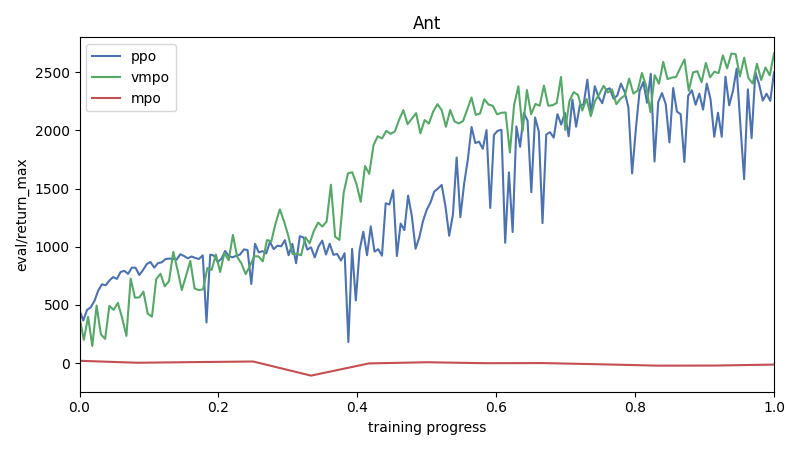
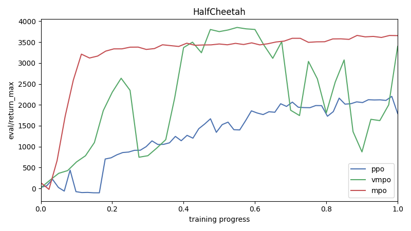
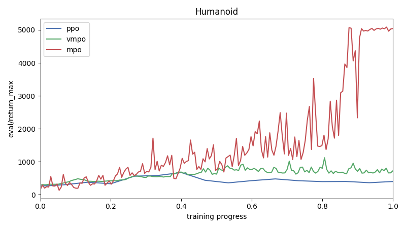
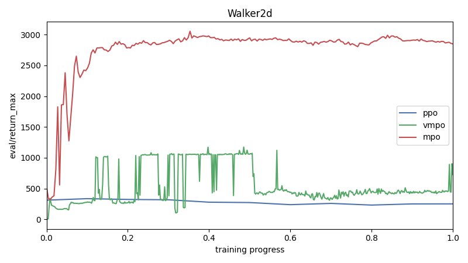
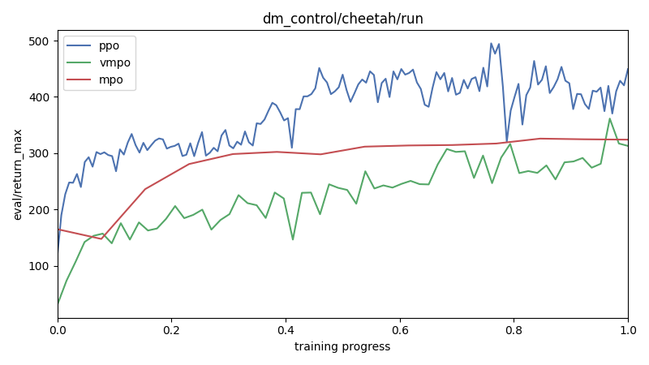
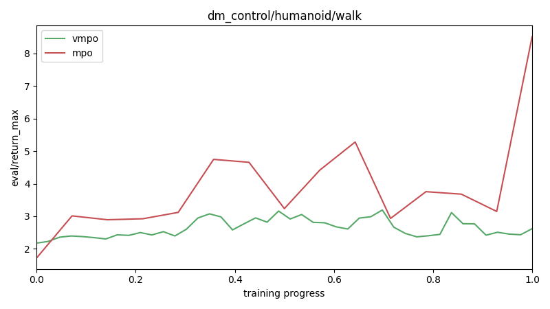
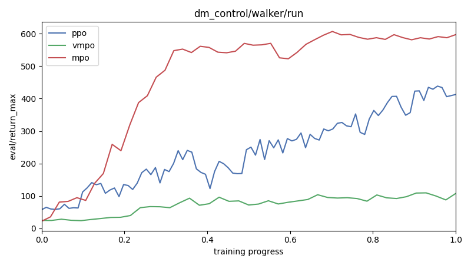
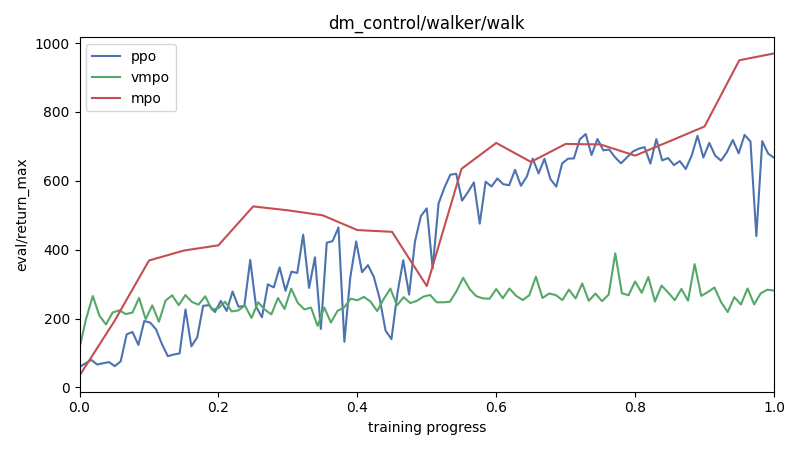

# Report

| Environment | ppo | vmpo | mpo |
|---|---|---|---|
| Ant | [2499](https://wandb.ai/adrian-research/env-ppo/runs/h5jodmfs) | [2661](https://wandb.ai/adrian-research/env-vmpo/runs/l6d7pqw9) | [-13](https://wandb.ai/adrian-research/env-mpo/runs/d9osexea) |
| HalfCheetah | [1793](https://wandb.ai/adrian-research/env-ppo/runs/j80ylpf0) | [3398](https://wandb.ai/adrian-research/env-vmpo/runs/ncp0m5la) | [3656](https://wandb.ai/adrian-research/env-mpo/runs/jq2lsn63) |
| Humanoid | [401](https://wandb.ai/adrian-research/env-ppo/runs/b7zd20e3) | [723](https://wandb.ai/adrian-research/env-vmpo/runs/zyrkxrho) | [5039](https://wandb.ai/adrian-research/env-mpo/runs/nw6adjcs) |
| Walker2d | [251](https://wandb.ai/adrian-research/env-ppo/runs/41l0vz7h) | [727](https://wandb.ai/adrian-research/env-vmpo/runs/idby2zoo) | [2848](https://wandb.ai/adrian-research/env-mpo/runs/i9h5drt4) |
| dm_control/cartpole/swingup | [296](https://wandb.ai/adrian-research/env-ppo/runs/19ggv8dc) | [335](https://wandb.ai/adrian-research/env-vmpo/runs/4awgz968) | - |
| dm_control/cheetah/run | [449](https://wandb.ai/adrian-research/env-ppo/runs/ctoiskyk) | [312](https://wandb.ai/adrian-research/env-vmpo/runs/o1hqmyv2) | [323](https://wandb.ai/adrian-research/env-mpo/runs/p4rjr7m0) |
| dm_control/humanoid/walk | - | [2](https://wandb.ai/adrian-research/env-vmpo/runs/ypmlm20p) | [8](https://wandb.ai/adrian-research/env-mpo/runs/wjdgdofc) |
| dm_control/walker/run | [412](https://wandb.ai/adrian-research/env-ppo/runs/4bixud5g) | [87](https://wandb.ai/adrian-research/env-vmpo/runs/cgchiogk) | [597](https://wandb.ai/adrian-research/env-mpo/runs/0z7lafw7) |
| dm_control/walker/walk | [666](https://wandb.ai/adrian-research/env-ppo/runs/75qmpv8z) | [281](https://wandb.ai/adrian-research/env-vmpo/runs/r28cfpn5) | [969](https://wandb.ai/adrian-research/env-mpo/runs/0hz2vxg1) |

## Ant



**ppo config:**

```json
{
  "clip_ratio": 0.15,
  "command": "ppo",
  "critic_layer_sizes": [
    256,
    256
  ],
  "ent_coef": 0.0003,
  "env": "Ant-v5",
  "eval_interval": 10000,
  "gae_lambda": 0.95,
  "gamma": 0.99,
  "max_grad_norm": 0.5,
  "minibatch_size": 512,
  "normalize_obs": true,
  "num_envs": 16,
  "out_dir": "checkpoints/ppo/Ant-v5",
  "policy_layer_sizes": [
    256,
    256
  ],
  "policy_lr": 0.0001,
  "rollout_steps": 8192,
  "save_interval": 1000000,
  "seed": 42,
  "target_kl": 0.02,
  "total_steps": 30000000,
  "update_epochs": 12,
  "value_lr": 2e-05,
  "vf_coef": 0.5,
  "wandb_entity": null,
  "wandb_group": null,
  "wandb_project": null
}
```

**vmpo config:**

```json
{
  "alpha_lr": 0.0001,
  "command": "vmpo",
  "env": "Ant-v5",
  "epsilon_eta": 0.7,
  "epsilon_mu": 0.05,
  "epsilon_sigma": 0.001,
  "eval_interval": 20000,
  "gamma": 0.99,
  "max_grad_norm": 0.5,
  "normalize_advantages": true,
  "num_envs": 16,
  "out_dir": "checkpoints/vmpo/Ant-v5",
  "policy_layer_sizes": [
    256,
    256
  ],
  "policy_lr": 0.0001,
  "popart_beta": 0.0001,
  "popart_eps": 1e-08,
  "popart_min_sigma": 0.001,
  "rollout_steps": 8192,
  "save_interval": 200000,
  "seed": 42,
  "temperature_init": 2,
  "temperature_lr": 0.001,
  "topk_fraction": 0.2,
  "total_steps": 30000000,
  "updates_per_step": 2,
  "value_layer_sizes": [
    512,
    256
  ],
  "value_lr": 0.0003,
  "wandb_entity": null,
  "wandb_group": null,
  "wandb_project": null
}
```

**mpo config:**

```json
{
  "action_penalization": false,
  "action_samples": 256,
  "batch_size": 512,
  "command": "mpo",
  "critic_layer_sizes": [
    512,
    512,
    256
  ],
  "env": "Ant-v5",
  "epsilon_mean": null,
  "epsilon_penalty": 0.001,
  "epsilon_stddev": null,
  "eval_interval": 7000,
  "gamma": 0.995,
  "kl_epsilon": 0.1,
  "lambda_init": 1,
  "lambda_lr": 0.0003,
  "max_grad_norm": 1,
  "mstep_kl_epsilon": 0.1,
  "out_dir": "checkpoints/mpo/Ant-v5",
  "per_dim_constraining": false,
  "policy_layer_sizes": [
    256,
    256,
    256
  ],
  "policy_lr": 0.0003,
  "q_lr": 0.0003,
  "replay_size": 1000000,
  "retrace_lambda": 0.95,
  "retrace_mc_actions": 8,
  "retrace_steps": 2,
  "save_interval": 50000,
  "seed": 42,
  "tau": 0.005,
  "temperature_init": 3,
  "temperature_lr": 0.0003,
  "total_steps": 50000000,
  "update_after": 10000,
  "updates_per_step": 1,
  "use_retrace": true,
  "wandb_entity": null,
  "wandb_group": null,
  "wandb_project": null
}
```

| Run | Algorithm | _step | eval/return_max |
|---|---|---:|---:|
| [mpo-Ant-v5](https://wandb.ai/adrian-research/env-mpo/runs/d9osexea) | mpo | 98718 | -13 |
| [mpo-Ant-v5](https://wandb.ai/adrian-research/env-mpo/runs/it4qbu56) | mpo | 86448 | -22 |
| [ppo-Ant-v5](https://wandb.ai/adrian-research/env-ppo/runs/h5jodmfs) | ppo | 30000000 | 2499 |
| [vmpo-Ant-v5](https://wandb.ai/adrian-research/env-vmpo/runs/l6d7pqw9) | vmpo | 3282119 | 2661 |
| [vmpo-Ant-v5](https://wandb.ai/adrian-research/env-vmpo/runs/k7hqg1vx) | vmpo | 432719 | 659 |
| [vmpo-Ant-v5](https://wandb.ai/adrian-research/env-vmpo/runs/1owofvwh) | vmpo | 233862 | 386 |

## HalfCheetah



**ppo config:**

```json
{
  "clip_ratio": 0.15,
  "command": "ppo",
  "critic_layer_sizes": [
    256,
    256
  ],
  "ent_coef": 0.0003,
  "env": "HalfCheetah-v5",
  "eval_interval": 10000,
  "gae_lambda": 0.95,
  "gamma": 0.99,
  "max_grad_norm": 0.5,
  "minibatch_size": 512,
  "normalize_obs": true,
  "num_envs": 16,
  "out_dir": "checkpoints/ppo/HalfCheetah-v5",
  "policy_layer_sizes": [
    256,
    256
  ],
  "policy_lr": 0.0001,
  "rollout_steps": 8192,
  "save_interval": 1000000,
  "seed": 42,
  "target_kl": 0.02,
  "total_steps": 10000000,
  "update_epochs": 12,
  "value_lr": 2e-05,
  "vf_coef": 0.5,
  "wandb_entity": null,
  "wandb_group": null,
  "wandb_project": null
}
```

**vmpo config:**

```json
{
  "alpha_lr": 0.0001,
  "command": "vmpo",
  "env": "HalfCheetah-v5",
  "epsilon_eta": 0.7,
  "epsilon_mu": 0.05,
  "epsilon_sigma": 0.001,
  "eval_interval": 20000,
  "gamma": 0.99,
  "max_grad_norm": 0.5,
  "normalize_advantages": true,
  "num_envs": 16,
  "out_dir": "checkpoints/vmpo/HalfCheetah-v5",
  "policy_layer_sizes": [
    256,
    256
  ],
  "policy_lr": 0.0001,
  "popart_beta": 0.0001,
  "popart_eps": 1e-08,
  "popart_min_sigma": 0.001,
  "rollout_steps": 8192,
  "save_interval": 200000,
  "seed": 42,
  "temperature_init": 2,
  "temperature_lr": 0.001,
  "topk_fraction": 0.2,
  "total_steps": 30000000,
  "updates_per_step": 2,
  "value_layer_sizes": [
    512,
    256
  ],
  "value_lr": 0.0003,
  "wandb_entity": null,
  "wandb_group": null,
  "wandb_project": null
}
```

**mpo config:**

```json
{
  "action_penalization": false,
  "action_samples": 256,
  "batch_size": 512,
  "command": "mpo",
  "critic_layer_sizes": [
    256,
    256,
    256
  ],
  "env": "HalfCheetah-v5",
  "epsilon_mean": null,
  "epsilon_penalty": 0.001,
  "epsilon_stddev": null,
  "eval_interval": 7000,
  "gamma": 0.995,
  "kl_epsilon": 0.1,
  "lambda_init": 1,
  "lambda_lr": 0.0003,
  "max_grad_norm": 1,
  "mstep_kl_epsilon": 0.1,
  "out_dir": "checkpoints/mpo/HalfCheetah-v5",
  "per_dim_constraining": false,
  "policy_layer_sizes": [
    256,
    256,
    256
  ],
  "policy_lr": 0.0003,
  "q_lr": 0.0003,
  "replay_size": 1000000,
  "retrace_lambda": 0.95,
  "retrace_mc_actions": 8,
  "retrace_steps": 2,
  "save_interval": 50000,
  "seed": 42,
  "tau": 0.005,
  "temperature_init": 3,
  "temperature_lr": 0.0003,
  "total_steps": 50000000,
  "update_after": 10000,
  "updates_per_step": 1,
  "use_retrace": true,
  "wandb_entity": null,
  "wandb_group": null,
  "wandb_project": null
}
```

| Run | Algorithm | _step | eval/return_max |
|---|---|---:|---:|
| [mpo-HalfCheetah-v5](https://wandb.ai/adrian-research/env-mpo/runs/jq2lsn63) | mpo | 327895 | 3656 |
| [mpo-HalfCheetah-v5](https://wandb.ai/adrian-research/env-mpo/runs/xpf6zu99) | mpo | 596969 | 3284 |
| [ppo-HalfCheetah-v5](https://wandb.ai/adrian-research/env-ppo/runs/j80ylpf0) | ppo | 10000000 | 1793 |
| [vmpo-HalfCheetah-v5](https://wandb.ai/adrian-research/env-vmpo/runs/ncp0m5la) | vmpo | 830829 | 3398 |
| [vmpo-HalfCheetah-v5](https://wandb.ai/adrian-research/env-vmpo/runs/2555f62w) | vmpo | 4840000 | 435 |
| [vmpo-HalfCheetah-v5](https://wandb.ai/adrian-research/env-vmpo/runs/mwr79rnl) | vmpo | 1126124 | 299 |
| [vmpo-HalfCheetah-v5](https://wandb.ai/adrian-research/env-vmpo/runs/jd07x2m1) | vmpo | 240000 | 213 |
| [vmpo-HalfCheetah-v5](https://wandb.ai/adrian-research/env-vmpo/runs/rnln9iw7) | vmpo | 180179 | 196 |
| [vmpo-HalfCheetah-v5](https://wandb.ai/adrian-research/env-vmpo/runs/iwu0ei3m) | vmpo | 284672 | 164 |
| [vmpo-HalfCheetah-v5](https://wandb.ai/adrian-research/env-vmpo/runs/bsgo5xsb) | vmpo | 581632 | 76 |
| [vmpo-HalfCheetah-v5](https://wandb.ai/adrian-research/env-vmpo/runs/vrrarkql) | vmpo | 81000 | 33 |
| [vmpo-HalfCheetah-v5](https://wandb.ai/adrian-research/env-vmpo/runs/buy6pujv) | vmpo | 233472 | 20 |
| [vmpo-HalfCheetah-v5](https://wandb.ai/adrian-research/env-vmpo/runs/1ok7yujv) | vmpo | 946945 | -166 |
| [vmpo-HalfCheetah-v5](https://wandb.ai/adrian-research/env-vmpo/runs/x6kazwh7) | vmpo | 593592 | -279 |
| [vmpo-HalfCheetah-v5](https://wandb.ai/adrian-research/env-vmpo/runs/jcjbrejo) | vmpo | 1000999 | -299 |
| [vmpo-HalfCheetah-v5](https://wandb.ai/adrian-research/env-vmpo/runs/a7q48w6q) | vmpo | 526525 | -299 |
| [vmpo-HalfCheetah-v5](https://wandb.ai/adrian-research/env-vmpo/runs/l7y8weki) | vmpo | 230229 | -345 |
| [vmpo-HalfCheetah-v5](https://wandb.ai/adrian-research/env-vmpo/runs/tixk5ko0) | vmpo | 803802 | -349 |
| [vmpo-HalfCheetah-v5](https://wandb.ai/adrian-research/env-vmpo/runs/4ecxwece) | vmpo | 485484 | -451 |
| [vmpo-HalfCheetah-v5](https://wandb.ai/adrian-research/env-vmpo/runs/tspiwvn4) | vmpo | 51200 | -1247 |
| [vmpo-HalfCheetah-v5](https://wandb.ai/adrian-research/env-vmpo/runs/7hh6neni) | vmpo | 299298 | - |
| [vmpo-HalfCheetah-v5](https://wandb.ai/adrian-research/env-vmpo/runs/63aeifvr) | vmpo | 197196 | - |
| [vmpo-HalfCheetah-v5](https://wandb.ai/adrian-research/env-vmpo/runs/t3x4mcse) | vmpo | 258048 | - |

## Humanoid



**ppo config:**

```json
{
  "clip_ratio": 0.15,
  "command": "ppo",
  "critic_layer_sizes": [
    512,
    256,
    256
  ],
  "ent_coef": 0.0003,
  "env": "Humanoid-v5",
  "eval_interval": 25000,
  "gae_lambda": 0.95,
  "gamma": 0.99,
  "max_grad_norm": 0.5,
  "minibatch_size": 512,
  "normalize_obs": true,
  "num_envs": 8,
  "out_dir": "checkpoints/ppo/Humanoid-v5",
  "policy_layer_sizes": [
    256,
    256,
    256
  ],
  "policy_lr": 0.0001,
  "rollout_steps": 8192,
  "save_interval": 1000000,
  "seed": 42,
  "target_kl": 0.02,
  "total_steps": 10000000,
  "update_epochs": 12,
  "value_lr": 2e-05,
  "vf_coef": 0.5,
  "wandb_entity": null,
  "wandb_group": null,
  "wandb_project": null
}
```

**vmpo config:**

```json
{
  "alpha_lr": 0.0001,
  "command": "vmpo",
  "env": "Humanoid-v5",
  "epsilon_eta": 0.25,
  "epsilon_mu": 0.05,
  "epsilon_sigma": 0.0003,
  "eval_interval": 10000,
  "gamma": 0.995,
  "max_grad_norm": 0.5,
  "normalize_advantages": true,
  "num_envs": 16,
  "out_dir": "checkpoints/vmpo/Humanoid-v5",
  "policy_layer_sizes": [
    256,
    256
  ],
  "policy_lr": 5e-05,
  "popart_beta": 0.0001,
  "popart_eps": 1e-08,
  "popart_min_sigma": 0.001,
  "rollout_steps": 8192,
  "save_interval": 100000,
  "seed": 42,
  "temperature_init": 2,
  "temperature_lr": 0.0005,
  "topk_fraction": 0.1,
  "total_steps": 30000000,
  "updates_per_step": 2,
  "value_layer_sizes": [
    512,
    256
  ],
  "value_lr": 0.0001,
  "wandb_entity": null,
  "wandb_group": null,
  "wandb_project": null
}
```

**mpo config:**

```json
{
  "action_penalization": false,
  "action_samples": 256,
  "batch_size": 512,
  "command": "mpo",
  "critic_layer_sizes": [
    256,
    256,
    256
  ],
  "env": "Humanoid-v5",
  "epsilon_mean": null,
  "epsilon_penalty": 0.001,
  "epsilon_stddev": null,
  "eval_interval": 2000,
  "gamma": 0.995,
  "kl_epsilon": 0.1,
  "lambda_init": 1,
  "lambda_lr": 0.0003,
  "max_grad_norm": 1,
  "mstep_kl_epsilon": 0.1,
  "out_dir": "checkpoints/mpo/Humanoid-v5",
  "per_dim_constraining": false,
  "policy_layer_sizes": [
    256,
    256,
    256
  ],
  "policy_lr": 0.0003,
  "q_lr": 0.0003,
  "replay_size": 1000000,
  "retrace_lambda": 0.95,
  "retrace_mc_actions": 8,
  "retrace_steps": 2,
  "save_interval": 50000,
  "seed": 42,
  "tau": 0.005,
  "temperature_init": 3,
  "temperature_lr": 0.0003,
  "total_steps": 50000000,
  "update_after": 500000,
  "updates_per_step": 1,
  "use_retrace": true,
  "wandb_entity": null,
  "wandb_group": null,
  "wandb_project": null
}
```

| Run | Algorithm | _step | eval/return_max |
|---|---|---:|---:|
| [mpo-Humanoid-v5](https://wandb.ai/adrian-research/env-mpo/runs/nw6adjcs) | mpo | 839364 | 5039 |
| [ppo-Humanoid-v5](https://wandb.ai/adrian-research/env-ppo/runs/b7zd20e3) | ppo | 3342336 | 401 |
| [ppo-Humanoid-v5](https://wandb.ai/adrian-research/env-ppo/runs/a6v3w2nb) | ppo | 309657 | 260 |
| [vmpo-Humanoid-v5](https://wandb.ai/adrian-research/env-vmpo/runs/zyrkxrho) | vmpo | 1614700 | 723 |
| [vmpo-Humanoid-v5](https://wandb.ai/adrian-research/env-vmpo/runs/x55rq3o1) | vmpo | 349790 | 599 |
| [vmpo-Humanoid-v5](https://wandb.ai/adrian-research/env-vmpo/runs/mh6d0538) | vmpo | 643914 | 556 |
| [vmpo-Humanoid-v5](https://wandb.ai/adrian-research/env-vmpo/runs/khwt1k70) | vmpo | 4489204 | 518 |
| [vmpo-Humanoid-v5](https://wandb.ai/adrian-research/env-vmpo/runs/h225rr9s) | vmpo | 312590 | 415 |
| [vmpo-Humanoid-v5](https://wandb.ai/adrian-research/env-vmpo/runs/gzsgcbex) | vmpo | 1278677 | 292 |
| [vmpo-Humanoid-v5](https://wandb.ai/adrian-research/env-vmpo/runs/axru234h) | vmpo | 153081 | 251 |
| [vmpo-Humanoid-v5](https://wandb.ai/adrian-research/env-vmpo/runs/h8vzmu4t) | vmpo | 258347 | 170 |
| [vmpo-Humanoid-v5](https://wandb.ai/adrian-research/env-vmpo/runs/9ypni4uk) | vmpo | 107190 | 130 |
| [vmpo-Humanoid-v5](https://wandb.ai/adrian-research/env-vmpo/runs/4j1wqnxk) | vmpo | 294912 | 123 |
| [vmpo-Humanoid-v5](https://wandb.ai/adrian-research/env-vmpo/runs/li8dalvf) | vmpo | 257922 | 115 |
| [vmpo-Humanoid-v5](https://wandb.ai/adrian-research/env-vmpo/runs/v2y84898) | vmpo | 166628 | 105 |
| [vmpo-Humanoid-v5](https://wandb.ai/adrian-research/env-vmpo/runs/ibfp5qlu) | vmpo | 180221 | 105 |
| [vmpo-Humanoid-v5](https://wandb.ai/adrian-research/env-vmpo/runs/r9q24ug4) | vmpo | 319248 | 104 |
| [vmpo-Humanoid-v5](https://wandb.ai/adrian-research/env-vmpo/runs/dlmj7a28) | vmpo | 128475 | 101 |
| [vmpo-Humanoid-v5](https://wandb.ai/adrian-research/env-vmpo/runs/mslua4qo) | vmpo | 399869 | 74 |
| [vmpo-Humanoid-v5](https://wandb.ai/adrian-research/env-vmpo/runs/h3f2fl1o) | vmpo | 1047804 | 66 |
| [vmpo-Humanoid-v5](https://wandb.ai/adrian-research/env-vmpo/runs/ml382adh) | vmpo | 118456 | - |
| [vmpo-Humanoid-v5](https://wandb.ai/adrian-research/env-vmpo/runs/5wp5wyv8) | vmpo | 85334 | - |
| [vmpo-Humanoid-v5](https://wandb.ai/adrian-research/env-vmpo/runs/gccc9rrb) | vmpo | 129131 | - |
| [vmpo-Humanoid-v5](https://wandb.ai/adrian-research/env-vmpo/runs/3usyd0oo) | vmpo | 159994 | - |

## Walker2d



**ppo config:**

```json
{
  "clip_ratio": 0.15,
  "command": "ppo",
  "critic_layer_sizes": [
    256,
    256
  ],
  "ent_coef": 0.0003,
  "env": "Walker2d-v5",
  "eval_interval": 10000,
  "gae_lambda": 0.95,
  "gamma": 0.99,
  "max_grad_norm": 0.5,
  "minibatch_size": 512,
  "normalize_obs": true,
  "num_envs": 16,
  "out_dir": "checkpoints/ppo/Walker2d-v5",
  "policy_layer_sizes": [
    256,
    256
  ],
  "policy_lr": 0.0001,
  "rollout_steps": 8192,
  "save_interval": 1000000,
  "seed": 42,
  "target_kl": 0.02,
  "total_steps": 30000000,
  "update_epochs": 12,
  "value_lr": 2e-05,
  "vf_coef": 0.5,
  "wandb_entity": null,
  "wandb_group": null,
  "wandb_project": null
}
```

**vmpo config:**

```json
{
  "alpha_lr": 0.0001,
  "command": "vmpo",
  "env": "Walker2d-v5",
  "epsilon_eta": 0.7,
  "epsilon_mu": 0.05,
  "epsilon_sigma": 0.001,
  "eval_interval": 20000,
  "gamma": 0.99,
  "max_grad_norm": 0.5,
  "normalize_advantages": true,
  "num_envs": 16,
  "out_dir": "checkpoints/vmpo/Walker2d-v5",
  "policy_layer_sizes": [
    256,
    256
  ],
  "policy_lr": 0.0001,
  "popart_beta": 0.0001,
  "popart_eps": 1e-08,
  "popart_min_sigma": 0.001,
  "rollout_steps": 8192,
  "save_interval": 200000,
  "seed": 42,
  "temperature_init": 2,
  "temperature_lr": 0.001,
  "topk_fraction": 0.2,
  "total_steps": 30000000,
  "updates_per_step": 2,
  "value_layer_sizes": [
    512,
    256
  ],
  "value_lr": 0.0003,
  "wandb_entity": null,
  "wandb_group": null,
  "wandb_project": null
}
```

**mpo config:**

```json
{
  "action_penalization": false,
  "action_samples": 256,
  "batch_size": 512,
  "command": "mpo",
  "critic_layer_sizes": [
    512,
    256,
    256
  ],
  "env": "Walker2d-v5",
  "epsilon_mean": null,
  "epsilon_penalty": 0.001,
  "epsilon_stddev": null,
  "eval_interval": 7000,
  "gamma": 0.995,
  "kl_epsilon": 0.1,
  "lambda_init": 1,
  "lambda_lr": 0.0003,
  "max_grad_norm": 1,
  "mstep_kl_epsilon": 0.1,
  "out_dir": "checkpoints/mpo/Walker2d-v5",
  "per_dim_constraining": false,
  "policy_layer_sizes": [
    256,
    256,
    256
  ],
  "policy_lr": 0.0003,
  "q_lr": 0.0003,
  "replay_size": 1000000,
  "retrace_lambda": 0.95,
  "retrace_mc_actions": 8,
  "retrace_steps": 2,
  "save_interval": 50000,
  "seed": 42,
  "tau": 0.005,
  "temperature_init": 3,
  "temperature_lr": 0.0003,
  "total_steps": 50000000,
  "update_after": 10000,
  "updates_per_step": 1,
  "use_retrace": true,
  "wandb_entity": null,
  "wandb_group": null,
  "wandb_project": null
}
```

| Run | Algorithm | _step | eval/return_max |
|---|---|---:|---:|
| [mpo-Walker2d-v5](https://wandb.ai/adrian-research/env-mpo/runs/i9h5drt4) | mpo | 1541254 | 2848 |
| [ppo-Walker2d-v5](https://wandb.ai/adrian-research/env-ppo/runs/41l0vz7h) | ppo | 1915489 | 251 |
| [vmpo-Walker2d-v5](https://wandb.ai/adrian-research/env-vmpo/runs/idby2zoo) | vmpo | 9589342 | 727 |

## dm_control/cartpole/swingup


**ppo config:**

```json
{
  "clip_ratio": 0.2,
  "command": "ppo",
  "critic_layer_sizes": [
    256,
    256,
    256
  ],
  "ent_coef": 0.001,
  "env": "dm_control/cartpole/swingup",
  "eval_interval": 50000,
  "gae_lambda": 0.95,
  "gamma": 0.99,
  "max_grad_norm": 0.5,
  "minibatch_size": 128,
  "normalize_obs": false,
  "num_envs": 1,
  "out_dir": "checkpoints/ppo/dm_control-cartpole-swingup",
  "policy_layer_sizes": [
    256,
    256,
    256
  ],
  "policy_lr": 0.0003,
  "rollout_steps": 512,
  "save_interval": 1000000,
  "seed": 42,
  "target_kl": 0.02,
  "total_steps": 1000000,
  "update_epochs": 4,
  "value_lr": 0.0001,
  "vf_coef": 0.5,
  "wandb_entity": null,
  "wandb_group": null,
  "wandb_project": null
}
```

**vmpo config:**

```json
{
  "alpha_lr": 0.001,
  "command": "vmpo",
  "env": "dm_control/cartpole/swingup",
  "epsilon_eta": 0.1,
  "epsilon_mu": 0.01,
  "epsilon_sigma": 0.0001,
  "eval_interval": 10000,
  "gamma": 0.99,
  "kl_mean_coef": 0.001,
  "kl_std_coef": 0.001,
  "max_grad_norm": 0.5,
  "normalize_advantages": true,
  "num_envs": 1,
  "out_dir": "checkpoints/vmpo/dm_control-cartpole-swingup",
  "policy_layer_sizes": [
    256,
    256,
    256
  ],
  "policy_lr": 0.0001,
  "popart_beta": 0.0001,
  "popart_eps": 1e-08,
  "popart_min_sigma": 0.001,
  "rollout_steps": 2048,
  "save_interval": 25000,
  "seed": 42,
  "temperature_init": 5,
  "temperature_lr": 0.001,
  "topk_fraction": 1,
  "total_steps": 2000000,
  "updates_per_step": 10,
  "value_layer_sizes": [
    256,
    256
  ],
  "value_lr": 0.0001,
  "wandb_entity": null,
  "wandb_group": null,
  "wandb_project": null
}
```

| Run | Algorithm | _step | eval/return_max |
|---|---|---:|---:|
| [ppo-dm_control/cartpole/swingup](https://wandb.ai/adrian-research/env-ppo/runs/19ggv8dc) | ppo | 1000000 | 296 |
| [ppo-dm_control/cartpole/swingup](https://wandb.ai/adrian-research/env-ppo/runs/owt21r0u) | ppo | 195194 | 159 |
| [ppo-dm_control/cartpole/swingup](https://wandb.ai/adrian-research/env-ppo/runs/lf0blhci) | ppo | 915456 | 130 |
| [vmpo-dm_control/cartpole/swingup](https://wandb.ai/adrian-research/env-vmpo/runs/4awgz968) | vmpo | 2000000 | 335 |

## dm_control/cheetah/run



**ppo config:**

```json
{
  "clip_ratio": 0.25,
  "command": "ppo",
  "critic_layer_sizes": [
    256,
    256,
    256
  ],
  "ent_coef": 0.0001,
  "env": "dm_control/cheetah/run",
  "eval_interval": 10000,
  "gae_lambda": 0.95,
  "gamma": 0.99,
  "max_grad_norm": 0.5,
  "minibatch_size": 256,
  "normalize_obs": true,
  "num_envs": 1,
  "out_dir": "checkpoints/ppo/dm_control-cheetah-run",
  "policy_layer_sizes": [
    256,
    256,
    256
  ],
  "policy_lr": 0.0002,
  "rollout_steps": 2048,
  "save_interval": 1000000,
  "seed": 42,
  "target_kl": 0.02,
  "total_steps": 3000000,
  "update_epochs": 4,
  "value_lr": 0.0003,
  "vf_coef": 1,
  "wandb_entity": null,
  "wandb_group": null,
  "wandb_project": null
}
```

**vmpo config:**

```json
{
  "alpha_lr": 0.0001,
  "command": "vmpo",
  "env": "dm_control/cheetah/run",
  "epsilon_eta": 0.1,
  "epsilon_mu": 0.05,
  "epsilon_sigma": 0.0006,
  "eval_interval": 25000,
  "gamma": 0.99,
  "max_grad_norm": 2,
  "normalize_advantages": true,
  "num_envs": 16,
  "out_dir": "checkpoints/vmpo/dm_control-cheetah-run",
  "policy_layer_sizes": [
    256,
    256
  ],
  "policy_lr": 0.0002,
  "popart_beta": 0.0001,
  "popart_eps": 1e-08,
  "popart_min_sigma": 0.001,
  "rollout_steps": 8192,
  "save_interval": 500000,
  "seed": 42,
  "temperature_init": 2,
  "temperature_lr": 0.0003,
  "topk_fraction": 0.25,
  "total_steps": 10000000,
  "updates_per_step": 2,
  "value_layer_sizes": [
    512,
    256
  ],
  "value_lr": 5e-05,
  "wandb_entity": null,
  "wandb_group": null,
  "wandb_project": null
}
```

**mpo config:**

```json
{
  "action_penalization": false,
  "action_samples": 128,
  "batch_size": 256,
  "command": "mpo",
  "critic_layer_sizes": [
    256,
    256,
    256
  ],
  "env": "dm_control/cheetah/run",
  "epsilon_mean": null,
  "epsilon_penalty": 0.001,
  "epsilon_stddev": null,
  "eval_interval": 10000,
  "gamma": 0.995,
  "kl_epsilon": 0.2,
  "lambda_init": 1,
  "lambda_lr": 0.0003,
  "max_grad_norm": 1,
  "mstep_kl_epsilon": 0.1,
  "out_dir": "checkpoints/mpo/dm_control-cheetah-run",
  "per_dim_constraining": true,
  "policy_layer_sizes": [
    256,
    256,
    256
  ],
  "policy_lr": 0.0003,
  "q_lr": 0.0003,
  "replay_size": 1000000,
  "retrace_lambda": 0.95,
  "retrace_mc_actions": 8,
  "retrace_steps": 2,
  "save_interval": 50000,
  "seed": 42,
  "tau": 0.005,
  "temperature_init": 1,
  "temperature_lr": 0.0003,
  "total_steps": 20000000,
  "update_after": 1000,
  "updates_per_step": 1,
  "use_retrace": true,
  "wandb_entity": null,
  "wandb_group": null,
  "wandb_project": null
}
```

| Run | Algorithm | _step | eval/return_max |
|---|---|---:|---:|
| [mpo-dm_control/cheetah/run](https://wandb.ai/adrian-research/env-mpo/runs/p4rjr7m0) | mpo | 145824 | 323 |
| [ppo-dm_control/cheetah/run](https://wandb.ai/adrian-research/env-ppo/runs/ctoiskyk) | ppo | 1474560 | 449 |
| [ppo-dm_control/cheetah/run](https://wandb.ai/adrian-research/env-ppo/runs/w43cikiv) | ppo | 1605632 | 313 |
| [ppo-dm_control/cheetah/run](https://wandb.ai/adrian-research/env-ppo/runs/xy554gzt) | ppo | 120113 | 260 |
| [vmpo-dm_control/cheetah/run](https://wandb.ai/adrian-research/env-vmpo/runs/o1hqmyv2) | vmpo | 1609607 | 312 |
| [vmpo-dm_control/cheetah/run](https://wandb.ai/adrian-research/env-vmpo/runs/hlw4xzaa) | vmpo | 790000 | 219 |
| [vmpo-dm_control/cheetah/run](https://wandb.ai/adrian-research/env-vmpo/runs/73r3uikl) | vmpo | 1572000 | 191 |
| [vmpo-dm_control/cheetah/run](https://wandb.ai/adrian-research/env-vmpo/runs/1d0c7i90) | vmpo | 452451 | 191 |
| [vmpo-dm_control/cheetah/run](https://wandb.ai/adrian-research/env-vmpo/runs/yf9m40iz) | vmpo | 250000 | 131 |
| [vmpo-dm_control/cheetah/run](https://wandb.ai/adrian-research/env-vmpo/runs/t1159psu) | vmpo | 454453 | 87 |

## dm_control/humanoid/walk



**vmpo config:**

```json
{
  "alpha_lr": 0.0001,
  "command": "vmpo",
  "env": "dm_control/humanoid/walk",
  "epsilon_eta": 0.7,
  "epsilon_mu": 0.05,
  "epsilon_sigma": 0.001,
  "eval_interval": 20000,
  "gamma": 0.99,
  "max_grad_norm": 0.5,
  "normalize_advantages": true,
  "num_envs": 16,
  "out_dir": "checkpoints/vmpo/dm_control-humanoid-walk",
  "policy_layer_sizes": [
    256,
    256
  ],
  "policy_lr": 0.0001,
  "popart_beta": 0.0001,
  "popart_eps": 1e-08,
  "popart_min_sigma": 0.001,
  "rollout_steps": 8192,
  "save_interval": 200000,
  "seed": 42,
  "temperature_init": 2,
  "temperature_lr": 0.001,
  "topk_fraction": 0.2,
  "total_steps": 30000000,
  "updates_per_step": 2,
  "value_layer_sizes": [
    512,
    256
  ],
  "value_lr": 0.0003,
  "wandb_entity": null,
  "wandb_group": null,
  "wandb_project": null
}
```

**mpo config:**

```json
{
  "action_penalization": false,
  "action_samples": 256,
  "batch_size": 512,
  "command": "mpo",
  "critic_layer_sizes": [
    512,
    256,
    256
  ],
  "env": "dm_control/humanoid/walk",
  "epsilon_mean": null,
  "epsilon_penalty": 0.001,
  "epsilon_stddev": null,
  "eval_interval": 20000,
  "gamma": 0.995,
  "kl_epsilon": 0.1,
  "lambda_init": 1,
  "lambda_lr": 0.0003,
  "max_grad_norm": 1,
  "mstep_kl_epsilon": 0.1,
  "out_dir": "checkpoints/mpo/dm_control-humanoid-walk",
  "per_dim_constraining": false,
  "policy_layer_sizes": [
    256,
    256,
    256
  ],
  "policy_lr": 0.0003,
  "q_lr": 0.0003,
  "replay_size": 1000000,
  "retrace_lambda": 0.95,
  "retrace_mc_actions": 8,
  "retrace_steps": 2,
  "save_interval": 50000,
  "seed": 42,
  "tau": 0.005,
  "temperature_init": 1,
  "temperature_lr": 0.0003,
  "total_steps": 50000000,
  "update_after": 500000,
  "updates_per_step": 2,
  "use_retrace": true,
  "wandb_entity": null,
  "wandb_group": null,
  "wandb_project": null
}
```

| Run | Algorithm | _step | eval/return_max |
|---|---|---:|---:|
| [mpo-dm_control/humanoid/walk](https://wandb.ai/adrian-research/env-mpo/runs/wjdgdofc) | mpo | 794816 | 8 |
| [mpo-dm_control/humanoid/walk](https://wandb.ai/adrian-research/env-mpo/runs/c31glteo) | mpo | 683232 | 4 |
| [vmpo-dm_control/humanoid/walk](https://wandb.ai/adrian-research/env-vmpo/runs/ypmlm20p) | vmpo | 891890 | 2 |

## dm_control/walker/run



**ppo config:**

```json
{
  "clip_ratio": 0.2,
  "command": "ppo",
  "critic_layer_sizes": [
    256,
    256,
    256
  ],
  "ent_coef": 0.0001,
  "env": "dm_control/walker/run",
  "eval_interval": 15000,
  "gae_lambda": 0.95,
  "gamma": 0.99,
  "max_grad_norm": 0.5,
  "minibatch_size": 256,
  "normalize_obs": true,
  "num_envs": 4,
  "out_dir": "checkpoints/ppo/dm_control-walker-run",
  "policy_layer_sizes": [
    256,
    256,
    256
  ],
  "policy_lr": 0.0002,
  "rollout_steps": 2048,
  "save_interval": 50000,
  "seed": 42,
  "target_kl": 0.02,
  "total_steps": 20000000,
  "update_epochs": 4,
  "value_lr": 0.0001,
  "vf_coef": 0.5,
  "wandb_entity": null,
  "wandb_group": null,
  "wandb_project": null
}
```

**vmpo config:**

```json
{
  "alpha_lr": 0.0005,
  "command": "vmpo",
  "env": "dm_control/walker/run",
  "epsilon_eta": 0.05,
  "epsilon_mu": 0.01,
  "epsilon_sigma": 0.0001,
  "eval_interval": 25000,
  "gamma": 0.99,
  "max_grad_norm": 0.5,
  "normalize_advantages": true,
  "num_envs": 16,
  "out_dir": "checkpoints/vmpo/dm_control-walker-run",
  "policy_layer_sizes": [
    256,
    256
  ],
  "policy_lr": 0.0003,
  "popart_beta": 0.0001,
  "popart_eps": 1e-08,
  "popart_min_sigma": 0.001,
  "rollout_steps": 8192,
  "save_interval": 50000,
  "seed": 42,
  "temperature_init": 2,
  "temperature_lr": 0.0003,
  "topk_fraction": 0.2,
  "total_steps": 40000000,
  "updates_per_step": 2,
  "value_layer_sizes": [
    512,
    256
  ],
  "value_lr": 0.0001,
  "wandb_entity": null,
  "wandb_group": null,
  "wandb_project": null
}
```

**mpo config:**

```json
{
  "action_penalization": false,
  "action_samples": 256,
  "batch_size": 256,
  "command": "mpo",
  "critic_layer_sizes": [
    256,
    256,
    256
  ],
  "env": "dm_control/walker/run",
  "epsilon_mean": null,
  "epsilon_penalty": 0.001,
  "epsilon_stddev": null,
  "eval_interval": 3000,
  "gamma": 0.995,
  "kl_epsilon": 0.1,
  "lambda_init": 1,
  "lambda_lr": 0.0003,
  "max_grad_norm": 1,
  "mstep_kl_epsilon": 0.1,
  "out_dir": "checkpoints/mpo/dm_control-walker-run",
  "per_dim_constraining": false,
  "policy_layer_sizes": [
    256,
    256,
    256
  ],
  "policy_lr": 0.0003,
  "q_lr": 0.0003,
  "replay_size": 1000000,
  "retrace_lambda": 0.95,
  "retrace_mc_actions": 8,
  "retrace_steps": 2,
  "save_interval": 50000,
  "seed": 42,
  "tau": 0.005,
  "temperature_init": 3,
  "temperature_lr": 0.0003,
  "total_steps": 40000000,
  "update_after": 500000,
  "updates_per_step": 2,
  "use_retrace": true,
  "wandb_entity": null,
  "wandb_group": null,
  "wandb_project": null
}
```

| Run | Algorithm | _step | eval/return_max |
|---|---|---:|---:|
| [mpo-dm_control/walker/run](https://wandb.ai/adrian-research/env-mpo/runs/0z7lafw7) | mpo | 643047 | 597 |
| [ppo-dm_control/walker/run](https://wandb.ai/adrian-research/env-ppo/runs/4bixud5g) | ppo | 5581569 | 412 |
| [vmpo-dm_control/walker/run](https://wandb.ai/adrian-research/env-vmpo/runs/cgchiogk) | vmpo | 1071069 | 87 |
| [vmpo-dm_control/walker/run](https://wandb.ai/adrian-research/env-vmpo/runs/ssvps0f0) | vmpo | 520519 | 74 |
| [vmpo-dm_control/walker/run](https://wandb.ai/adrian-research/env-vmpo/runs/xmgn2e8c) | vmpo | 586000 | 61 |
| [vmpo-dm_control/walker/run](https://wandb.ai/adrian-research/env-vmpo/runs/be8o5v5l) | vmpo | 5535000 | 49 |

## dm_control/walker/walk



**ppo config:**

```json
{
  "clip_ratio": 0.2,
  "command": "ppo",
  "critic_layer_sizes": [
    256,
    256,
    256
  ],
  "ent_coef": 0.0001,
  "env": "dm_control/walker/walk",
  "eval_interval": 15000,
  "gae_lambda": 0.95,
  "gamma": 0.99,
  "max_grad_norm": 0.5,
  "minibatch_size": 128,
  "normalize_obs": true,
  "num_envs": 4,
  "out_dir": "checkpoints/ppo/dm_control-walker-walk",
  "policy_layer_sizes": [
    256,
    256,
    256
  ],
  "policy_lr": 0.0002,
  "rollout_steps": 2048,
  "save_interval": 50000,
  "seed": 42,
  "target_kl": 0.02,
  "total_steps": 10000000,
  "update_epochs": 4,
  "value_lr": 0.0001,
  "vf_coef": 0.5,
  "wandb_entity": null,
  "wandb_group": null,
  "wandb_project": null
}
```

**vmpo config:**

```json
{
  "alpha_lr": 0.0005,
  "command": "vmpo",
  "env": "dm_control/walker/walk",
  "epsilon_eta": 0.05,
  "epsilon_mu": 0.01,
  "epsilon_sigma": 0.0001,
  "eval_interval": 25000,
  "gamma": 0.99,
  "max_grad_norm": 0.5,
  "num_envs": 2,
  "out_dir": "checkpoints/vmpo/dm_control-walker-walk",
  "policy_layer_sizes": [
    256,
    256,
    256
  ],
  "policy_lr": 0.0003,
  "rollout_steps": 4096,
  "save_interval": 50000,
  "seed": 42,
  "temperature_init": 3,
  "temperature_lr": 0.0003,
  "topk_fraction": 0.25,
  "total_steps": 40000000,
  "updates_per_step": 2,
  "value_lr": 0.0001,
  "wandb_entity": null,
  "wandb_group": null,
  "wandb_project": null
}
```

**mpo config:**

```json
{
  "action_penalization": false,
  "action_samples": 256,
  "batch_size": 256,
  "command": "mpo",
  "critic_layer_sizes": [
    256,
    256,
    256
  ],
  "env": "dm_control/walker/walk",
  "epsilon_mean": null,
  "epsilon_penalty": 0.001,
  "epsilon_stddev": null,
  "eval_interval": 3000,
  "gamma": 0.995,
  "kl_epsilon": 0.1,
  "lambda_init": 1,
  "lambda_lr": 0.0003,
  "max_grad_norm": 1,
  "mstep_kl_epsilon": 0.1,
  "out_dir": "checkpoints/mpo/dm_control-walker-walk",
  "per_dim_constraining": false,
  "policy_layer_sizes": [
    256,
    256,
    256
  ],
  "policy_lr": 0.0003,
  "q_lr": 0.0003,
  "replay_size": 1000000,
  "retrace_lambda": 0.95,
  "retrace_mc_actions": 8,
  "retrace_steps": 2,
  "save_interval": 50000,
  "seed": 42,
  "tau": 0.005,
  "temperature_init": 1,
  "temperature_lr": 0.0003,
  "total_steps": 40000000,
  "update_after": 500000,
  "updates_per_step": 2,
  "use_retrace": true,
  "wandb_entity": null,
  "wandb_group": null,
  "wandb_project": null
}
```

| Run | Algorithm | _step | eval/return_max |
|---|---|---:|---:|
| [mpo-dm_control/walker/walk](https://wandb.ai/adrian-research/env-mpo/runs/0hz2vxg1) | mpo | 563447 | 969 |
| [ppo-dm_control/walker/walk](https://wandb.ai/adrian-research/env-ppo/runs/75qmpv8z) | ppo | 7143424 | 666 |
| [vmpo-dm_control/walker/walk](https://wandb.ai/adrian-research/env-vmpo/runs/r28cfpn5) | vmpo | 5300294 | 281 |
| [vmpo-dm_control/walker/walk](https://wandb.ai/adrian-research/env-vmpo/runs/gyi89ofn) | vmpo | 1638400 | 230 |

