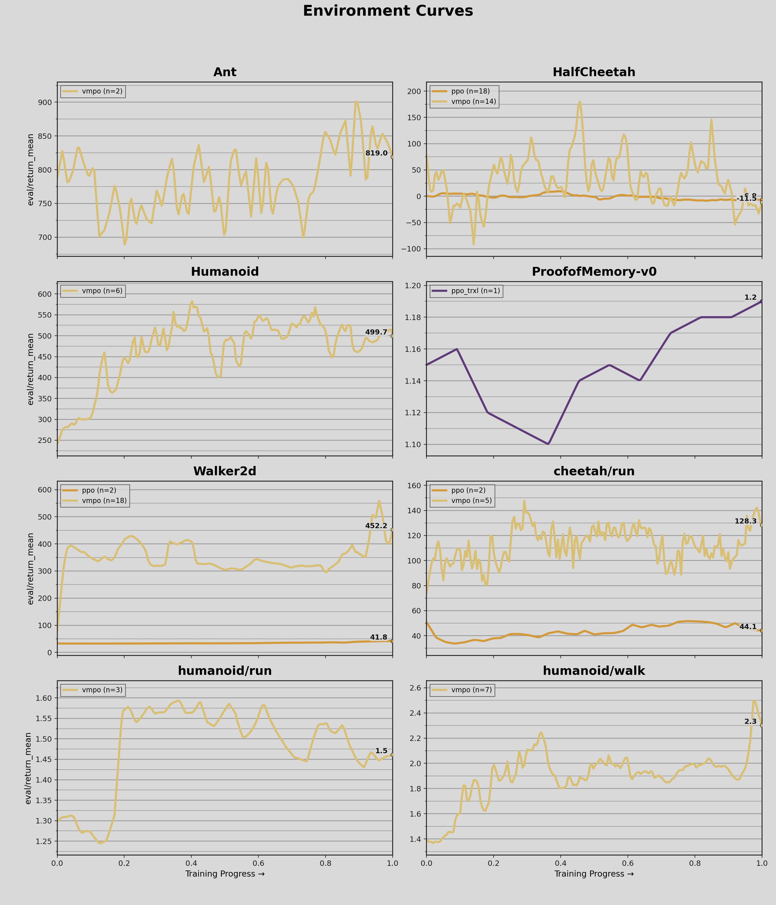

# Report: `adrian-research/minerva-rl`

- Generated: 2026-02-14 14:03:24
- Included runs: 87 (`_step` > 10000)
- Algorithm key source: run config `command`
- Environment key source: run config `env`
- Metric: `eval/return_mean`

Each line is a time-weighted average across runs for a single environment and algorithm. Every run timeline is normalized to `[0, 1]`.

Max achieved table (`eval/return_max`, fallback to selected metric), reported as `max +/- std` across runs.

| Environment | `ppo` | `ppo_trxl` | `vmpo` |
|---|---|---|---|
| `Ant` | - | - | 969.4 +/- 75.6 |
| `HalfCheetah` | 74.3 +/- 38.3 | - | 1913.0 +/- 521.2 |
| `Humanoid` | - | - | 758.3 +/- 135.6 |
| `ProofofMemory-v0` | - | 1.4 +/- 0.0 | - |
| `Walker2d` | 67.5 +/- 15.2 | - | 1990.7 +/- 387.3 |
| `cheetah/run` | 55.9 +/- 2.0 | - | 245.9 +/- 72.4 |
| `humanoid/run` | - | - | 3.1 +/- 0.4 |
| `humanoid/walk` | - | - | 8.9 +/- 2.6 |

## Hyperparameters by Algorithm

Rows are hyperparameters and columns are environments. If multiple runs differ for a cell, values are listed together.

### `ppo`

| Hyperparameter | `HalfCheetah` | `Walker2d` | `cheetah/run` |
|---|---|---|---|
| `anneal_lr` | True | True | True |
| `clip_ratio` | 0.15 / 0.2 | 0.15 | 0.25 |
| `clip_vloss` | True | True | True |
| `critic_layer_sizes` | [512,256] / [512,512,256] / [526,526,256] | [526,526,256] | [526,526,256] |
| `device` | None | None | None |
| `ent_coef` | 0 / 0.0001 / 0.0003 | 0.0003 | 0.0001 |
| `eval_interval` | 10000 | 10000 | 10000 |
| `gae_lambda` | 0.95 | 0.95 | 0.95 |
| `gamma` | 0.99 | 0.99 | 0.99 |
| `generate_video` | False | - | False |
| `max_grad_norm` | 0.5 / 1 / 1.5 | 0.5 | 0.5 |
| `minibatch_size` | 128 / 256 / 512 / 64 | 512 | 256 |
| `norm_adv` | True | True | True |
| `normalize_obs` | True | True | True |
| `num_envs` | 1 | 1 / 16 | 1 |
| `optimizer_type` | adam | adam | adam |
| `policy_layer_sizes` | [256,256,256] / [256,256] | [256,256,256] | [256,256,256] |
| `policy_lr` | 0.0001 / 0.0002 / 0.0003 | 0.0001 | 0.0002 |
| `rollout_steps` | 1024 / 2048 / 512 / 8192 | 8192 | 2048 |
| `save_interval` | 1000000 | 1000000 | 1000000 |
| `seed` | 42 | 42 | 42 |
| `sgd_momentum` | 0.9 | 0.9 | 0.9 |
| `target_kl` | 0 / 0.02 | 0.02 | 0.02 |
| `total_steps` | 1000000 / 2000000 | 30000000 | 3000000 |
| `update_epochs` | 10 / 12 / 5 / 6 | 12 | 4 |
| `value_lr` | 0.0001 / 0.0003 / 2e-05 / 3e-05 | 2e-05 | 0.0003 |
| `vf_coef` | 0.5 | 0.5 | 1 |

### `ppo_trxl`

| Hyperparameter | `ProofofMemory-v0` |
|---|---|
| `anneal_steps` | 163840000 |
| `clip_coef` | 0.2 |
| `clip_vloss` | True |
| `device` | None |
| `eval_interval` | 2048 |
| `final_ent_coef` | 1e-06 |
| `final_lr` | 1e-05 |
| `gae_lambda` | 0.95 |
| `gamma` | 0.995 |
| `generate_video` | False |
| `init_ent_coef` | 0.001 |
| `init_lr` | 0.0003 |
| `max_grad_norm` | 0.5 |
| `norm_adv` | False |
| `num_envs` | 16 |
| `num_minibatches` | 8 |
| `num_steps` | 128 |
| `optimizer_type` | None |
| `reconstruction_coef` | 0 |
| `save_interval` | 8192 |
| `seed` | 42 |
| `sgd_momentum` | None |
| `target_kl` | None |
| `total_steps` | 25000 |
| `trxl_dim` | 64 |
| `trxl_memory_length` | 16 |
| `trxl_num_heads` | 1 |
| `trxl_num_layers` | 4 |
| `trxl_positional_encoding` | none |
| `update_epochs` | 4 |
| `vf_coef` | 0.1 |

### `vmpo`

| Hyperparameter | `Ant` | `HalfCheetah` | `Humanoid` | `Walker2d` | `cheetah/run` | `humanoid/run` | `humanoid/walk` |
|---|---|---|---|---|---|---|---|
| `advantage_estimator` | returns | gae / returns | returns | returns | returns | returns | returns |
| `alpha_lr` | 0.0001 | 0.0001 / 0.0003 | 0.0001 / 0.0003 | 0.0001 | 0.0001 | 0.0001 | 5e-05 |
| `device` | None | None | None | None | None | None | None |
| `epsilon_eta` | 0.25 / 0.7 | 0.25 / 0.7 | 0.05 / 0.25 | 0.25 / 0.7 | 0.1 | 0.1 / 0.3 | 0.1 |
| `epsilon_mu` | 0.05 | 0.05 | 0.05 | 0.05 | 0.05 | 0.05 | 0.01 / 0.05 |
| `epsilon_sigma` | 0.001 | 0.001 | 0.0003 | 0.001 | 0.0001 / 0.0006 | 0.0003 | 0.02 |
| `eval_interval` | 10000 | 10000 / 20000 | 10000 | 10000 / 20000 | 10000 / 25000 | 10000 | 10000 |
| `gae_lambda` | 0.95 | 0.95 | 0.95 | 0.95 | 0.95 | 0.95 | 0.97 |
| `gamma` | 0.99 | 0.99 | 0.995 | 0.99 | 0.99 | 0.995 | 0.99 / 0.995 |
| `generate_video` | False | False | False | False / True | False | False | False |
| `max_grad_norm` | 0.5 / 1 | 0.5 / 1 / 1.5 | 0.5 / 1 | 0.5 / 1 | 1 / 2 | 0.5 / 1 | 0.5 / 1 |
| `normalize_advantages` | True | False / True | False / True | True | True | True | True |
| `num_envs` | 1 | 1 / 16 | 1 | 1 | 1 / 16 | 1 | 1 |
| `optimizer_type` | adam | adam | adam | adam | adam | adam | adam |
| `policy_layer_sizes` | [256,256,256] | [256,256,256] | [256,256,256] | [256,256,256] | [256,256,256] | [256,256,256] | [256,256,256] |
| `policy_lr` | 0.0001 | 0.0001 / 0.0002 | 0.0001 / 5e-05 | 0.0001 | 0.0002 | 5e-05 | 0.0001 |
| `popart_beta` | - | 0.0001 | - | 0.0001 | - | - | - |
| `popart_eps` | - | 1e-08 | - | 1e-08 | - | - | - |
| `popart_min_sigma` | - | 0.001 | - | 0.001 | - | - | - |
| `rollout_steps` | 1024 / 2048 | 1024 / 512 / 8192 | 1024 / 2048 / 4096 | 2048 / 4096 | 1024 / 2048 / 8192 | 8192 | 1024 / 4096 / 8192 |
| `save_interval` | 200000 | 200000 | 100000 | 200000 | 500000 | 100000 | 200000 |
| `seed` | 42 | 42 | 42 | 42 | 42 | 42 | 42 |
| `sgd_momentum` | 0.9 | 0.9 | 0.9 | 0.9 | 0.9 | 0.9 | 0.9 |
| `temperature_init` | 1 / 2 | 2 | 1 / 2 | 1 / 2 | 1 / 2 | 1 / 4 | 1 |
| `temperature_lr` | 0.001 | 0.001 | 0.0002 / 0.0005 | 0.001 | 0.0003 | 0.0005 | 0.0001 |
| `topk_fraction` | 0.2 / 0.4 | 0.2 / 0.25 / 0.4 / 0.45 | 0.1 / 0.3 / 0.4 | 0.4 | 0.25 / 0.4 | 0.4 | 0.3 / 0.4 / 0.5 |
| `total_steps` | 1000000 | 1000000 / 30000000 | 1000000 / 3000000 | 1000000 / 30000000 | 1000000 / 10000000 / 4000000 | 1000000 / 4000000 | 1000000 / 1500000 |
| `m_steps` | 1 / 2 | 1 / 2 | 1 / 2 / 4 | 1 | 2 | 1 / 12 / 6 | 1 / 3 / 4 / 6 |
| `value_layer_sizes` | [526,526,256] | [526,526,256] | [526,526,256] | [526,526,256] | [526,526,256] | [526,526,256] | [526,526,256] |
| `value_lr` | 0.0003 | 0.0003 | 0.0001 | 0.0003 | 0.0003 / 5e-05 | 0.0001 | 0.0003 |

## Summary

| Environment | Algorithms | Runs |
|---|---|---:|
| `Ant` | `vmpo` | 2 |
| `HalfCheetah` | `ppo`, `vmpo` | 34 |
| `Humanoid` | `vmpo` | 6 |
| `ProofofMemory-v0` | `ppo_trxl` | 1 |
| `Walker2d` | `ppo`, `vmpo` | 26 |
| `cheetah/run` | `ppo`, `vmpo` | 8 |
| `humanoid/run` | `vmpo` | 3 |
| `humanoid/walk` | `vmpo` | 7 |

## Ant

| Algorithm | Averaged Runs | Total Weight (_step) |
|---|---:|---:|
| `vmpo` | 2 | 704571 |

| Run | Algorithm | _step | eval/return_mean |
|---|---|---:|---:|
| [vmpo-Ant-v5-seed42](https://wandb.ai/adrian-research/minerva-rl/runs/acih2ynl) | `vmpo` | 53248 | 533.019 |
| [vmpo-Ant-v5-seed42](https://wandb.ai/adrian-research/minerva-rl/runs/o3lqy1za) | `vmpo` | 651323 | 842.343 |

## HalfCheetah

| Algorithm | Averaged Runs | Total Weight (_step) |
|---|---:|---:|
| `ppo` | 18 | 6724505 |
| `vmpo` | 14 | 9124016 |

| Run | Algorithm | _step | eval/return_mean |
|---|---|---:|---:|
| [ppo-HalfCheetah-v5-seed42](https://wandb.ai/adrian-research/minerva-rl/runs/3rtye6nm) | `ppo` | 532480 | -1.561 |
| [ppo-HalfCheetah-v5-seed42](https://wandb.ai/adrian-research/minerva-rl/runs/tzk7xkbk) | `ppo` | 579578 | 22.082 |
| [ppo-HalfCheetah-v5-seed42](https://wandb.ai/adrian-research/minerva-rl/runs/lecxo9ao) | `ppo` | 346345 | -41.511 |
| [ppo-HalfCheetah-v5-seed42](https://wandb.ai/adrian-research/minerva-rl/runs/gyutgq84) | `ppo` | 530529 | -50.544 |
| [ppo-HalfCheetah-v5-seed42](https://wandb.ai/adrian-research/minerva-rl/runs/zweuzpii) | `ppo` | 409088 | -53.791 |
| [ppo-HalfCheetah-v5-seed42](https://wandb.ai/adrian-research/minerva-rl/runs/3q2ce45m) | `ppo` | 999424 | 22.714 |
| [ppo-HalfCheetah-v5-seed42](https://wandb.ai/adrian-research/minerva-rl/runs/5w7qv7qe) | `ppo` | 68067 | 24.149 |
| [ppo-HalfCheetah-v5-seed42](https://wandb.ai/adrian-research/minerva-rl/runs/4eebf9hj) | `ppo` | 61060 | -0.460 |
| [ppo-HalfCheetah-v5-seed42](https://wandb.ai/adrian-research/minerva-rl/runs/wj4c6gan) | `ppo` | 1107105 | -63.089 |
| [ppo-HalfCheetah-v5-seed42](https://wandb.ai/adrian-research/minerva-rl/runs/1ws93abj) | `ppo` | 10240 | - |
| [ppo-HalfCheetah-v5-seed42](https://wandb.ai/adrian-research/minerva-rl/runs/tdq8fido) | `ppo` | 190464 | 31.231 |
| [ppo-HalfCheetah-v5-seed42](https://wandb.ai/adrian-research/minerva-rl/runs/ogpl6lsn) | `ppo` | 411648 | 20.547 |
| [ppo-HalfCheetah-v5-seed42](https://wandb.ai/adrian-research/minerva-rl/runs/y08fyzac) | `ppo` | 749748 | 25.690 |
| [ppo-HalfCheetah-v5-seed42](https://wandb.ai/adrian-research/minerva-rl/runs/cvctyirk) | `ppo` | 501760 | 15.796 |
| [ppo-HalfCheetah-v5-seed42](https://wandb.ai/adrian-research/minerva-rl/runs/qubtoaud) | `ppo` | 64063 | 48.222 |
| [ppo-HalfCheetah-v5-seed42](https://wandb.ai/adrian-research/minerva-rl/runs/4hv3605n) | `ppo` | 40039 | 42.405 |
| [ppo-HalfCheetah-v5-seed42](https://wandb.ai/adrian-research/minerva-rl/runs/r8zi22zt) | `ppo` | 19018 | 25.879 |
| [ppo-HalfCheetah-v5-seed42](https://wandb.ai/adrian-research/minerva-rl/runs/wroit0qr) | `ppo` | 88064 | 28.107 |
| [ppo-HalfCheetah-v5-seed42](https://wandb.ai/adrian-research/minerva-rl/runs/216a70t1) | `ppo` | 26025 | 44.274 |
| [vmpo-HalfCheetah-v5-seed42](https://wandb.ai/adrian-research/minerva-rl/runs/go9sgart) | `vmpo` | 163840 | 1536.114 |
| [vmpo-HalfCheetah-v5-seed42](https://wandb.ai/adrian-research/minerva-rl/runs/2t04gfka) | `vmpo` | 18000 | - |
| [vmpo-HalfCheetah-v5-seed42](https://wandb.ai/adrian-research/minerva-rl/runs/yuuzhp20) | `vmpo` | 711000 | 320.989 |
| [vmpo-HalfCheetah-v5-seed42](https://wandb.ai/adrian-research/minerva-rl/runs/t2ds75cf) | `vmpo` | 788000 | 530.685 |
| [vmpo-HalfCheetah-v5-seed42](https://wandb.ai/adrian-research/minerva-rl/runs/c93205ua) | `vmpo` | 422000 | 36.728 |
| [vmpo-HalfCheetah-v5-seed42](https://wandb.ai/adrian-research/minerva-rl/runs/9gvzrj3e) | `vmpo` | 313000 | 0.675 |
| [vmpo-HalfCheetah-v5-seed42](https://wandb.ai/adrian-research/minerva-rl/runs/v98tq0vt) | `vmpo` | 1000000 | -24.521 |
| [vmpo-HalfCheetah-v5-seed42](https://wandb.ai/adrian-research/minerva-rl/runs/fcieme5m) | `vmpo` | 767488 | -19.601 |
| [vmpo-HalfCheetah-v5-seed42](https://wandb.ai/adrian-research/minerva-rl/runs/2pg5a15k) | `vmpo` | 1000000 | -409.379 |
| [vmpo-HalfCheetah-v5-seed42](https://wandb.ai/adrian-research/minerva-rl/runs/rfju5myu) | `vmpo` | 1000000 | 3.394 |
| [vmpo-HalfCheetah-v5-seed42](https://wandb.ai/adrian-research/minerva-rl/runs/wdcc6wee) | `vmpo` | 559616 | 14.871 |
| [vmpo-HalfCheetah-v5-seed42](https://wandb.ai/adrian-research/minerva-rl/runs/beh8ip5f) | `vmpo` | 67072 | -258.691 |
| [vmpo-HalfCheetah-v5-seed42](https://wandb.ai/adrian-research/minerva-rl/runs/1lxrb485) | `vmpo` | 501000 | -254.775 |
| [vmpo-HalfCheetah-v5-seed42](https://wandb.ai/adrian-research/minerva-rl/runs/fe35zebo) | `vmpo` | 831000 | -217.872 |
| [vmpo-HalfCheetah-v5-seed42](https://wandb.ai/adrian-research/minerva-rl/runs/wxri5km8) | `vmpo` | 1000000 | -255.045 |

## Humanoid

| Algorithm | Averaged Runs | Total Weight (_step) |
|---|---:|---:|
| `vmpo` | 6 | 3796874 |

| Run | Algorithm | _step | eval/return_mean |
|---|---|---:|---:|
| [vmpo-Humanoid-v5-seed42](https://wandb.ai/adrian-research/minerva-rl/runs/biwy764o) | `vmpo` | 295474 | 485.636 |
| [vmpo-Humanoid-v5-seed42](https://wandb.ai/adrian-research/minerva-rl/runs/6k1c60qb) | `vmpo` | 898435 | 504.766 |
| [vmpo-Humanoid-v5-seed42](https://wandb.ai/adrian-research/minerva-rl/runs/28hh57de) | `vmpo` | 159671 | 445.997 |
| [vmpo-Humanoid-v5-seed42](https://wandb.ai/adrian-research/minerva-rl/runs/ys7c8o2n) | `vmpo` | 382212 | 357.155 |
| [vmpo-Humanoid-v5-seed42](https://wandb.ai/adrian-research/minerva-rl/runs/rc0re0fa) | `vmpo` | 221159 | 407.310 |
| [vmpo-Humanoid-v5-seed42](https://wandb.ai/adrian-research/minerva-rl/runs/xmhsk125) | `vmpo` | 1839923 | 544.863 |

## ProofofMemory-v0

| Algorithm | Averaged Runs | Total Weight (_step) |
|---|---:|---:|
| `ppo_trxl` | 1 | 24576 |

| Run | Algorithm | _step | eval/return_mean |
|---|---|---:|---:|
| [ppo_trxl-ProofofMemory-v0-seed42](https://wandb.ai/adrian-research/minerva-rl/runs/q58ib1jb) | `ppo_trxl` | 24576 | 1.190 |

## Walker2d

| Algorithm | Averaged Runs | Total Weight (_step) |
|---|---:|---:|
| `ppo` | 2 | 957327 |
| `vmpo` | 18 | 8015621 |

| Run | Algorithm | _step | eval/return_mean |
|---|---|---:|---:|
| [ppo-Walker2d-v5](https://wandb.ai/adrian-research/minerva-rl/runs/j0quq8yd) | `ppo` | 703537 | 34.510 |
| [ppo-Walker2d-v5](https://wandb.ai/adrian-research/minerva-rl/runs/u6ghs7cq) | `ppo` | 253790 | 62.102 |
| [vmpo-Walker2d-v5](https://wandb.ai/adrian-research/minerva-rl/runs/hsains1f) | `vmpo` | 577475 | 230.709 |
| [vmpo-Walker2d-v5](https://wandb.ai/adrian-research/minerva-rl/runs/gshdnha3) | `vmpo` | 762574 | 267.569 |
| [vmpo-Walker2d-v5](https://wandb.ai/adrian-research/minerva-rl/runs/yz788fey) | `vmpo` | 497899 | 283.974 |
| [vmpo-Walker2d-v5](https://wandb.ai/adrian-research/minerva-rl/runs/sdw1j18x) | `vmpo` | 737696 | 278.266 |
| [vmpo-Walker2d-v5](https://wandb.ai/adrian-research/minerva-rl/runs/n45m9cqq) | `vmpo` | 226522 | 266.922 |
| [vmpo-Walker2d-v5](https://wandb.ai/adrian-research/minerva-rl/runs/a6a2ebyr) | `vmpo` | 686476 | 354.489 |
| [vmpo-Walker2d-v5](https://wandb.ai/adrian-research/minerva-rl/runs/5zl95qdw) | `vmpo` | 538624 | 278.277 |
| [vmpo-Walker2d-v5-seed42](https://wandb.ai/adrian-research/minerva-rl/runs/igdhtj27) | `vmpo` | 259302 | 294.614 |
| [vmpo-Walker2d-v5-seed42](https://wandb.ai/adrian-research/minerva-rl/runs/tlzo617c) | `vmpo` | 189368 | 417.202 |
| [vmpo-Walker2d-v5-seed42](https://wandb.ai/adrian-research/minerva-rl/runs/nkpj9f7c) | `vmpo` | 1140000 | 204.173 |
| [vmpo-Walker2d-v5-seed42](https://wandb.ai/adrian-research/minerva-rl/runs/ysagpx80) | `vmpo` | 19994 | - |
| [vmpo-Walker2d-v5-seed42](https://wandb.ai/adrian-research/minerva-rl/runs/qb1t3igm) | `vmpo` | 19994 | - |
| [vmpo-Walker2d-v5-seed42](https://wandb.ai/adrian-research/minerva-rl/runs/giq0xfi1) | `vmpo` | 19994 | - |
| [vmpo-Walker2d-v5-seed42](https://wandb.ai/adrian-research/minerva-rl/runs/pkwnutdt) | `vmpo` | 19994 | - |
| [vmpo-Walker2d-v5-seed42](https://wandb.ai/adrian-research/minerva-rl/runs/csot79kk) | `vmpo` | 127577 | 287.175 |
| [vmpo-Walker2d-v5-seed42](https://wandb.ai/adrian-research/minerva-rl/runs/um2jy71x) | `vmpo` | 19994 | - |
| [vmpo-Walker2d-v5-seed42](https://wandb.ai/adrian-research/minerva-rl/runs/usaqkgsp) | `vmpo` | 19994 | - |
| [vmpo-Walker2d-v5-seed42](https://wandb.ai/adrian-research/minerva-rl/runs/lu4ge5mp) | `vmpo` | 305948 | 302.183 |
| [vmpo-Walker2d-v5-seed42](https://wandb.ai/adrian-research/minerva-rl/runs/gj04icp5) | `vmpo` | 27150 | 98.533 |
| [vmpo-Walker2d-v5-seed42](https://wandb.ai/adrian-research/minerva-rl/runs/1lxjvvrz) | `vmpo` | 219647 | 280.702 |
| [vmpo-Walker2d-v5-seed42](https://wandb.ai/adrian-research/minerva-rl/runs/qybeelc8) | `vmpo` | 179773 | 286.567 |
| [vmpo-Walker2d-v5-seed42](https://wandb.ai/adrian-research/minerva-rl/runs/hst20ims) | `vmpo` | 189881 | 371.672 |
| [vmpo-Walker2d-v5-seed42](https://wandb.ai/adrian-research/minerva-rl/runs/6dithgkv) | `vmpo` | 349709 | 388.438 |
| [vmpo-Walker2d-v5-seed42](https://wandb.ai/adrian-research/minerva-rl/runs/jwg2hw9j) | `vmpo` | 1000000 | 1647.857 |

## cheetah/run

| Algorithm | Averaged Runs | Total Weight (_step) |
|---|---:|---:|
| `ppo` | 2 | 529552 |
| `vmpo` | 5 | 2584680 |

| Run | Algorithm | _step | eval/return_mean |
|---|---|---:|---:|
| [ppo-dm_control/cheetah/run-seed42](https://wandb.ai/adrian-research/minerva-rl/runs/a1jvuftj) | `ppo` | 378000 | 41.902 |
| [ppo-dm_control/cheetah/run-seed42](https://wandb.ai/adrian-research/minerva-rl/runs/47i7r5kz) | `ppo` | 10240 | - |
| [ppo-dm_control/cheetah/run-seed42](https://wandb.ai/adrian-research/minerva-rl/runs/289zs29n) | `ppo` | 151552 | 49.499 |
| [vmpo-dm_control/cheetah/run-seed42](https://wandb.ai/adrian-research/minerva-rl/runs/6plsvk0i) | `vmpo` | 196608 | 39.440 |
| [vmpo-dm_control/cheetah/run-seed42](https://wandb.ai/adrian-research/minerva-rl/runs/5zpefen4) | `vmpo` | 55000 | 55.377 |
| [vmpo-dm_control/cheetah/run-seed42](https://wandb.ai/adrian-research/minerva-rl/runs/uicsjfsm) | `vmpo` | 481000 | 177.230 |
| [vmpo-dm_control/cheetah/run-seed42](https://wandb.ai/adrian-research/minerva-rl/runs/3ethdcmd) | `vmpo` | 259072 | 26.290 |
| [vmpo-dm_control/cheetah/run-seed42](https://wandb.ai/adrian-research/minerva-rl/runs/39r7z09l) | `vmpo` | 1593000 | 143.589 |

## humanoid/run

| Algorithm | Averaged Runs | Total Weight (_step) |
|---|---:|---:|
| `vmpo` | 3 | 1735000 |

| Run | Algorithm | _step | eval/return_mean |
|---|---|---:|---:|
| [vmpo-dm_control/humanoid/run-seed42](https://wandb.ai/adrian-research/minerva-rl/runs/aa0enhf5) | `vmpo` | 824000 | 1.404 |
| [vmpo-dm_control/humanoid/run-seed42](https://wandb.ai/adrian-research/minerva-rl/runs/bb28nvc7) | `vmpo` | 489000 | 1.527 |
| [vmpo-dm_control/humanoid/run-seed42](https://wandb.ai/adrian-research/minerva-rl/runs/o65wqvcl) | `vmpo` | 422000 | 1.498 |

## humanoid/walk

| Algorithm | Averaged Runs | Total Weight (_step) |
|---|---:|---:|
| `vmpo` | 7 | 4391032 |

| Run | Algorithm | _step | eval/return_mean |
|---|---|---:|---:|
| [vmpo-dm_control/humanoid/walk-seed42](https://wandb.ai/adrian-research/minerva-rl/runs/dc51jihf) | `vmpo` | 217000 | 1.260 |
| [vmpo-dm_control/humanoid/walk-seed42](https://wandb.ai/adrian-research/minerva-rl/runs/3lademjj) | `vmpo` | 1196032 | 2.739 |
| [vmpo-dm_control/humanoid/walk-seed42](https://wandb.ai/adrian-research/minerva-rl/runs/mh1ks74n) | `vmpo` | 240000 | 2.050 |
| [vmpo-dm_control/humanoid/walk-seed42](https://wandb.ai/adrian-research/minerva-rl/runs/sea7p5n5) | `vmpo` | 299000 | 1.482 |
| [vmpo-dm_control/humanoid/walk-seed42](https://wandb.ai/adrian-research/minerva-rl/runs/de4m8c46) | `vmpo` | 889000 | 1.497 |
| [vmpo-dm_control/humanoid/walk-seed42](https://wandb.ai/adrian-research/minerva-rl/runs/i5gvadk7) | `vmpo` | 50000 | 1.271 |
| [vmpo-dm_control/humanoid/walk-seed42](https://wandb.ai/adrian-research/minerva-rl/runs/4h1g12g3) | `vmpo` | 1500000 | 2.820 |

