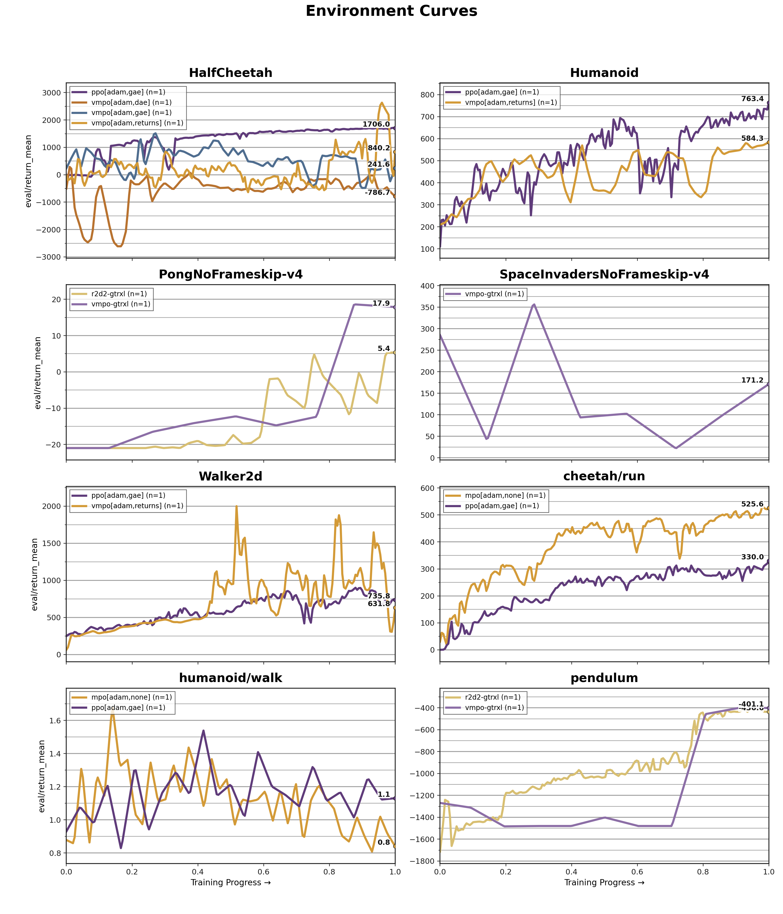

# Report: `adrian-research/minerva-rl-benchmark-7`

- Generated: 2026-02-15 15:44:45
- Included runs: 17 (`_step` > 1000)
- Algorithm key source: run config `command`
- Environment key source: run config `env` + `optimizer_type` + `advantage_estimator`
- Metric: `eval/return_mean`

Each line is a time-weighted average across runs for a single environment/optimizer/advantage-type and algorithm. Every run timeline is normalized to `[0, 1]`.

Max achieved table (`eval/return_max`, fallback to selected metric), reported as `max +/- std` across runs.

| Environment | `mpo` | `ppo` | `r2d2-gtrxl` | `vmpo` | `vmpo-gtrxl` |
|---|---|---|---|---|---|
| `HalfCheetah[adam,dae]` | - | - | - | -485.4 +/- 0.0 | - |
| `HalfCheetah[adam,gae]` | - | 1819.0 +/- 0.0 | - | 553.1 +/- 0.0 | - |
| `HalfCheetah[adam,returns]` | - | - | - | 1746.4 +/- 0.0 | - |
| `Humanoid[adam,gae]` | - | 1413.6 +/- 0.0 | - | - | - |
| `Humanoid[adam,returns]` | - | - | - | 939.7 +/- 0.0 | - |
| `PongNoFrameskip-v4` | - | - | 11.0 +/- 0.0 | - | 18.0 +/- 0.0 |
| `SpaceInvadersNoFrameskip-v4` | - | - | - | - | 175.0 +/- 0.0 |
| `Walker2d[adam,gae]` | - | 1013.6 +/- 0.0 | - | - | - |
| `Walker2d[adam,returns]` | - | - | - | 1165.7 +/- 0.0 | - |
| `cheetah/run[adam,gae]` | - | 438.4 +/- 0.0 | - | - | - |
| `cheetah/run[adam,none]` | 530.9 +/- 0.0 | - | - | - | - |
| `humanoid/walk[adam,gae]` | - | 2.1 +/- 0.0 | - | - | - |
| `humanoid/walk[adam,none]` | 2.0 +/- 0.0 | - | - | - | - |
| `pendulum` | - | - | -3.1 +/- 0.0 | - | -3.0 +/- 0.0 |

## Hyperparameters by Algorithm

Rows are hyperparameters and columns are environments. If multiple runs differ for a cell, values are listed together.

### `mpo`

| Hyperparameter | `cheetah/run[adam,none]` | `humanoid/walk[adam,none]` |
|---|---|---|
| `action_penalization` | False | False |
| `action_samples` | 32 | 256 |
| `batch_size` | 128 | 512 |
| `critic_layer_sizes` | [512,512,256] | [512,512,256] |
| `device` | None | None |
| `epsilon_penalty` | 0.001 | 0.001 |
| `gamma` | 0.995 | 0.995 |
| `kl_epsilon` | 0.2 | 0.1 |
| `lambda_init` | 1 | 1 |
| `lambda_lr` | 0.0003 | 0.0003 |
| `max_grad_norm` | 1 | 1 |
| `mstep_kl_epsilon` | 0.3 | 0.1 |
| `optimizer_type` | adam | adam |
| `per_dim_constraining` | False | True |
| `policy_layer_sizes` | [256,256,256] | [256,256,256] |
| `policy_lr` | 0.0003 | 0.0003 |
| `q_lr` | 0.0003 | 0.0003 |
| `replay_size` | 1000000 | 1000000 |
| `retrace_lambda` | 0.95 | 0.95 |
| `retrace_mc_actions` | 8 | 8 |
| `retrace_steps` | 2 | 2 |
| `seed` | 42 | 42 |
| `sgd_momentum` | 0.9 | 0.9 |
| `target_critic_update_period` | 100 | 100 |
| `target_policy_update_period` | 50 | 100 |
| `temperature_init` | 1 | 1 |
| `temperature_lr` | 0.0003 | 0.0003 |
| `total_steps` | 400000 | 400000 |
| `update_after` | 1000 | 1000 |
| `updates_per_step` | 1 | 2 |
| `use_retrace` | False | True |

### `ppo`

Environments 1-4 of 5.

| Hyperparameter | `HalfCheetah[adam,gae]` | `Humanoid[adam,gae]` | `Walker2d[adam,gae]` | `cheetah/run[adam,gae]` |
|---|---|---|---|---|
| `advantage_estimator` | - | - | - | - |
| `anneal_lr` | True | True | True | True |
| `clip_ratio` | 0.2 | 0.2 | 0.2 | 0.2 |
| `clip_vloss` | True | True | True | True |
| `critic_layer_sizes` | [512,512,256] | [512,512,256] | [512,512,256] | [512,512,256] |
| `device` | None | None | None | None |
| `ent_coef` | 0 | 0 | 0 | 0 |
| `gae_lambda` | 0.92 | 0.92 | 0.92 | 0.92 |
| `gamma` | 0.98 | 0.98 | 0.98 | 0.98 |
| `max_grad_norm` | 0.8 | 0.8 | 0.8 | 0.8 |
| `minibatch_size` | 32 | 32 | 32 | 32 |
| `norm_adv` | True | True | True | True |
| `normalize_obs` | True | True | True | True |
| `num_envs` | 1 | 1 | 1 | 1 |
| `optimizer_type` | adam | adam | adam | adam |
| `policy_layer_sizes` | [256,256,256] | [256,256,256] | [256,256,256] | [256,256,256] |
| `policy_lr` | 0.0002 | 0.0002 | 0.0002 | 0.0002 |
| `rollout_steps` | 2048 | 2048 | 2048 | 2048 |
| `seed` | 42 | 42 | 42 | 42 |
| `sgd_momentum` | 0.9 | 0.9 | 0.9 | 0.9 |
| `target_kl` | 0 | 0 | 0 | 0 |
| `total_steps` | 500000 | 500000 | 500000 | 500000 |
| `update_epochs` | 10 | 10 | 10 | 10 |
| `vf_coef` | 0.5 | 0.5 | 0.5 | 0.5 |

Environments 5-5 of 5.

| Hyperparameter | `humanoid/walk[adam,gae]` |
|---|---|
| `advantage_estimator` | None |
| `anneal_lr` | True |
| `clip_ratio` | 0.2 |
| `clip_vloss` | True |
| `critic_layer_sizes` | [512,512,256] |
| `device` | None |
| `ent_coef` | 0 |
| `gae_lambda` | 0.92 |
| `gamma` | 0.98 |
| `max_grad_norm` | 0.8 |
| `minibatch_size` | 32 |
| `norm_adv` | True |
| `normalize_obs` | True |
| `num_envs` | 1 |
| `optimizer_type` | adam |
| `policy_layer_sizes` | [256,256,256] |
| `policy_lr` | 0.0002 |
| `rollout_steps` | 2048 |
| `seed` | 42 |
| `sgd_momentum` | 0.9 |
| `target_kl` | 0 |
| `total_steps` | 500000 |
| `update_epochs` | 10 |
| `vf_coef` | 0.5 |

### `vmpo`

Environments 1-4 of 5.

| Hyperparameter | `HalfCheetah[adam,dae]` | `HalfCheetah[adam,gae]` | `HalfCheetah[adam,returns]` | `Humanoid[adam,returns]` |
|---|---|---|---|---|
| `advantage_estimator` | dae | gae | returns | returns |
| `alpha_lr` | 0.0003 | 0.0003 | 0.0003 | 0.0003 |
| `device` | None | None | None | None |
| `epsilon_eta` | 0.25 | 0.25 | 0.25 | 0.05 |
| `epsilon_mu` | 0.05 | 0.05 | 0.05 | 0.05 |
| `epsilon_sigma` | 0.001 | 0.001 | 0.001 | 0.0003 |
| `gae_lambda` | 0.95 | 0.95 | 0.95 | 0.95 |
| `gamma` | 0.99 | 0.99 | 0.99 | 0.995 |
| `max_grad_norm` | 1 | 1 | 1 | 1 |
| `normalize_advantages` | True | True | True | True |
| `num_envs` | 1 | 1 | 1 | 1 |
| `optimizer_type` | adam | adam | adam | adam |
| `policy_layer_sizes` | [256,256,256] | [256,256,256] | [256,256,256] | [256,256,256] |
| `policy_lr` | 0.0002 | 0.0002 | 0.0002 | 0.0001 |
| `rollout_steps` | 1024 | 1024 | 1024 | 4096 |
| `seed` | 42 | 42 | 42 | 42 |
| `sgd_momentum` | 0.9 | 0.9 | 0.9 | 0.9 |
| `temperature_init` | 2 | 2 | 2 | 1 |
| `temperature_lr` | 0.001 | 0.001 | 0.001 | 0.0002 |
| `topk_fraction` | 0.45 | 0.45 | 0.45 | 0.4 |
| `total_steps` | 3000000 | 3000000 | 3000000 | 3000000 |
| `updates_per_step` | 1 | 1 | 1 | 1 |
| `value_layer_sizes` | [512,512,256] | [512,512,256] | [512,512,256] | [512,512,256] |
| `value_lr` | 0.0003 | 0.0003 | 0.0003 | 0.0001 |

Environments 5-5 of 5.

| Hyperparameter | `Walker2d[adam,returns]` |
|---|---|
| `advantage_estimator` | returns |
| `alpha_lr` | 0.0001 |
| `device` | None |
| `epsilon_eta` | 0.25 |
| `epsilon_mu` | 0.05 |
| `epsilon_sigma` | 0.001 |
| `gae_lambda` | 0.95 |
| `gamma` | 0.99 |
| `max_grad_norm` | 1 |
| `normalize_advantages` | True |
| `num_envs` | 1 |
| `optimizer_type` | adam |
| `policy_layer_sizes` | [256,256,256] |
| `policy_lr` | 0.0001 |
| `rollout_steps` | 4096 |
| `seed` | 42 |
| `sgd_momentum` | 0.9 |
| `temperature_init` | 1 |
| `temperature_lr` | 0.001 |
| `topk_fraction` | 0.4 |
| `total_steps` | 3000000 |
| `updates_per_step` | 1 |
| `value_layer_sizes` | [512,512,256] |
| `value_lr` | 0.0003 |

